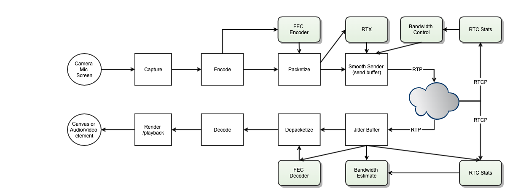

######################
WebRTC 传输概论
######################

.. include:: ../links.ref
.. include:: ../tags.ref
.. include:: ../abbrs.ref

.. contents::
    :local:

概论
============

WebRTC 进行传输最重要的要搞清楚两点：一是协商媒体传输通道， 二是协商媒体传输参数

* 协商媒体传输通道是通过 ICE(Interactive Connectivity Establishment) 框架来实现的。

它综合运用了 STUN（Session Traversal Using Relays around NAT）
和 TURN(Traversal Using Relays around NAT) 协议来发现和穿越 NAT，建立端到端的传输通道。

* 协商媒体传输参数是通过交换 SDP（Session Description Protocol）来实现的

SDP 中包含了媒体编解码器、传输地址、安全参数等关键信息，双方通过 Offer/Answer 模型来协商出一组双方都支持的参数。

WebRTC 的传输层是一个精心设计的协议栈，从底层的 UDP/TCP 传输，到 NAT 穿越，再到安全加密，最后到媒体数据的传输，
每一层都有明确的职责分工。理解这个协议栈的全貌，是深入学习 WebRTC 传输机制的基础。

传输协议栈全景图
--------------------------

WebRTC 的传输协议栈可以从下到上分为以下几层：

.. code-block:: text

    ┌─────────────────────────────────────────────────────────┐
    │              Application Layer 应用层                     │
    │         Audio / Video / DataChannel Data                 │
    ├──────────────┬──────────────────────┬───────────────────┤
    │  媒体传输层   │    RTP / RTCP        │   SCTP            │
    │              │  (Audio & Video)     │  (DataChannel)    │
    ├──────────────┴──────────────────────┴───────────────────┤
    │              安全层 Security Layer                        │
    │         SRTP / SRTCP          │        DTLS             │
    ├───────────────────────────────┴─────────────────────────┤
    │              NAT 穿越层 NAT Traversal Layer               │
    │              ICE / STUN / TURN                           │
    ├─────────────────────────────────────────────────────────┤
    │              传输层 Transport Layer                       │
    │              UDP (主要) / TCP (备选)                      │
    ├─────────────────────────────────────────────────────────┤
    │              网络层 Network Layer                         │
    │              IP (IPv4 / IPv6)                            │
    └─────────────────────────────────────────────────────────┘

各层的职责如下：

1. **网络层 (Network Layer)**: 提供 IP 寻址和路由功能，支持 IPv4 和 IPv6。
2. **传输层 (Transport Layer)**: 以 UDP 为主要传输协议，TCP 作为 fallback。UDP 的低延迟特性非常适合实时音视频传输。
3. **NAT 穿越层 (NAT Traversal Layer)**: ICE 框架协调 STUN 和 TURN，实现 NAT 穿越，建立端到端连接。
4. **安全层 (Security Layer)**: DTLS 用于密钥协商，SRTP/SRTCP 用于媒体数据的加密和认证。
5. **媒体传输层 (Media Transport Layer)**: RTP/RTCP 承载音视频数据及其控制信息，SCTP 承载 DataChannel 数据。

这种分层设计使得 WebRTC 能够在复杂的网络环境中可靠地传输实时媒体数据，同时保证安全性和低延迟。

协议栈详解
============

网络层与传输层
--------------------------

WebRTC 的媒体传输以 UDP 为主要传输协议。选择 UDP 的原因在于：

* **低延迟**: UDP 没有 TCP 的三次握手和拥塞控制机制，减少了传输延迟。
* **无队头阻塞 (No Head-of-Line Blocking)**: UDP 数据包独立传输，一个包的丢失不会阻塞后续包的接收。
* **实时性优先**: 对于音视频通信，及时性比可靠性更重要。丢失一两个音频帧远比等待重传导致的延迟更可接受。

然而，在某些受限的网络环境中（例如企业防火墙只允许 TCP 443 端口），UDP 可能被阻断。
此时 WebRTC 支持 TCP 作为 fallback 方案：

* **ICE-TCP (RFC 6544)**: 允许 ICE candidate 使用 TCP 传输。
* **TURN over TCP/TLS**: 通过 TURN 服务器的 TCP 或 TLS 连接中继媒体数据。
* **WebSocket fallback**: 某些实现还支持通过 WebSocket 隧道传输媒体。

在实际部署中，UDP 的连通率通常在 90% 以上，加上 TURN relay 后可以达到接近 100% 的连通率。

NAT 穿越层
--------------------------

NAT (Network Address Translation) 是互联网中广泛使用的技术，它允许多个设备共享一个公网 IP 地址。
然而，NAT 也给端到端通信带来了挑战，因为 NAT 后面的设备没有公网可达的地址。

ICE (Interactive Connectivity Establishment) 框架是 WebRTC 解决 NAT 穿越问题的核心机制。
它综合运用了以下技术：

**STUN (Session Traversal Utilities for NAT)**

STUN 协议（RFC 8489）允许客户端发现自己的公网地址和端口映射。其工作原理如下：

1. 客户端向 STUN 服务器发送 Binding Request
2. STUN 服务器在响应中返回客户端的公网 IP 和端口（即 Server-Reflexive Address）
3. 客户端使用这个地址作为 ICE candidate 之一

STUN 适用于大多数 NAT 类型（Full Cone、Address-Restricted Cone、Port-Restricted Cone），
但对于 Symmetric NAT 则无能为力。

**TURN (Traversal Using Relays around NAT)**

TURN 协议（RFC 5766）提供了一种中继方案，当直接连接和 STUN 都无法穿越 NAT 时使用：

1. 客户端向 TURN 服务器申请分配一个中继地址（Relayed Address）
2. 所有媒体数据通过 TURN 服务器中继转发
3. 虽然增加了延迟和服务器负载，但保证了连通性

**ICE 候选收集与连接建立流程**

ICE 的工作流程分为以下几个阶段：

1. **Candidate Gathering（候选收集）**: 收集所有可能的连接地址

   - Host Candidate: 本机网卡地址
   - Server-Reflexive Candidate: 通过 STUN 发现的公网地址
   - Relayed Candidate: 通过 TURN 分配的中继地址

2. **Candidate Exchange（候选交换）**: 通过信令通道交换双方的 candidate 列表

3. **Connectivity Checks（连通性检查）**: 对所有 candidate pair 进行 STUN Binding 检查

4. **Candidate Pair Prioritization（候选对排序）**: 按优先级排序，优先选择直连路径

5. **Nomination（提名）**: 选择最优的 candidate pair 作为传输通道

6. **Keep-alive（保活）**: 定期发送 STUN Binding Indication 维持 NAT 映射

安全层
--------------------------

WebRTC 强制要求所有媒体传输都必须加密，这是通过 DTLS-SRTP 机制实现的。

**DTLS Handshake（DTLS 握手）**

DTLS (Datagram Transport Layer Security) 是 TLS 的 UDP 版本，定义在 RFC 6347（DTLS 1.2）和 RFC 9147（DTLS 1.3）中。
在 WebRTC 中，DTLS 握手发生在 ICE 连接建立之后：

1. ICE 连接建立成功后，双方在同一个 UDP 端口上开始 DTLS 握手
2. DTLS 握手过程中交换证书、协商加密套件
3. 握手完成后，双方共享了一组密钥材料（keying material）

DTLS 握手的关键特点：

* 使用自签名证书（self-signed certificate），不依赖 CA
* 证书指纹（fingerprint）通过 SDP 中的 ``a=fingerprint`` 属性传递
* 支持 DTLS-SRTP 扩展（use_srtp extension），用于协商 SRTP 保护 profile

**SRTP 密钥派生（DTLS-SRTP Key Derivation）**

DTLS-SRTP（RFC 5764）是 WebRTC 中密钥管理的标准机制：

1. 在 DTLS 握手过程中，通过 ``use_srtp`` 扩展协商 SRTP protection profile
2. DTLS 握手完成后，使用 TLS Exporter（RFC 5705）从 DTLS 会话中导出密钥材料
3. 导出的密钥材料被分割为 SRTP 的 master key 和 master salt
4. 从 master key 和 master salt 进一步派生出 session key，用于 RTP/RTCP 的加密和认证

这种方式比在 SDP 中直接传递密钥（SDES 方式）更安全，因为密钥从不在信令通道中明文传输。

**SRTP/SRTCP 加密**

SRTP (Secure Real-time Transport Protocol, RFC 3711) 对 RTP 数据包进行加密和认证：

* 加密 RTP payload（音视频数据），但不加密 RTP header
* 对整个 RTP 包（包括 header）计算认证标签（authentication tag）
* 使用 AES-128-CM（Counter Mode）或 AES-256-GCM 等加密算法
* SRTCP 对 RTCP 包提供类似的保护

媒体传输层
--------------------------

**RTP/RTCP 用于音视频传输**

RTP (Real-time Transport Protocol, RFC 3550) 是 WebRTC 中音视频数据的载体：

* RTP 包头包含序列号（sequence number）、时间戳（timestamp）、SSRC 等关键字段
* 序列号用于检测丢包和乱序
* 时间戳用于音视频同步和播放时序控制
* SSRC 标识媒体流的来源

RTCP (RTP Control Protocol) 与 RTP 配合使用，提供传输质量反馈：

* **SR (Sender Report)**: 发送端报告，包含发送统计和 NTP/RTP 时间戳映射
* **RR (Receiver Report)**: 接收端报告，包含丢包率、抖动等统计
* **SDES (Source Description)**: 源描述信息，如 CNAME
* **BYE**: 离开通知
* **APP**: 应用自定义消息
* **RTPFB/PSFB**: 传输层和负载特定反馈，如 NACK、PLI、FIR 等

**SCTP 用于 DataChannel**

SCTP (Stream Control Transmission Protocol, RFC 4960) 在 WebRTC 中用于 DataChannel 的数据传输：

* SCTP 运行在 DTLS 之上（SCTP over DTLS over UDP）
* 支持可靠和不可靠两种传输模式
* 支持有序和无序传输
* 支持多流复用（multiple streams）
* 内置拥塞控制和流量控制

DataChannel 的协议栈为：

.. code-block:: text

    ┌──────────────────┐
    │   DataChannel    │
    │   Application    │
    ├──────────────────┤
    │      SCTP        │
    ├──────────────────┤
    │      DTLS        │
    ├──────────────────┤
    │    ICE / UDP     │
    └──────────────────┘

多路复用
--------------------------

WebRTC 使用 BUNDLE（RFC 8843）机制将多路媒体流复用到单个传输通道上，
这大大减少了 ICE 协商的开销和所需的端口数量。

**单端口复用 RTP/RTCP/STUN/DTLS**

在 BUNDLE 模式下，所有类型的数据包共享同一个 UDP 端口（即同一个 5-tuple）。
接收端通过检查数据包的第一个字节来区分不同类型的协议：

.. code-block:: text

                  +----------------+
                  | 127 < B < 192 -+--> RTP/RTCP
                  |                |
      packet -->  |  19 < B < 64  -+--> DTLS
                  |                |
                  |       B < 2   -+--> STUN
                  +----------------+

其中 B 是数据包第一个字节的值。这种区分方式定义在 RFC 7983 中。

**BUNDLE 策略**

WebRTC API 中通过 ``bundlePolicy`` 配置 BUNDLE 行为：

* ``max-bundle``: 尽可能将所有媒体流 bundle 到一个连接上
* ``max-compat``: 如果对端不支持 BUNDLE，则每个媒体流使用独立连接
* ``balanced``: 折中方案，至少保留一个音频和一个视频连接

**媒体流标识**

在 BUNDLE 模式下，多路媒体流共享同一个传输通道，需要通过以下标识来区分：

* **MID (Media Identification)**: 标识 SDP 中的 m= section，通过 RTP header extension 携带
* **RID (Restriction Identifier)**: 标识同一媒体源的不同质量层（用于 Simulcast）
* **SSRC**: 标识 RTP 流的同步源

信令协商
============

Offer/Answer 模型
--------------------------

WebRTC 使用 SDP (Session Description Protocol) 的 Offer/Answer 模型（RFC 3264）来协商媒体参数。
基本流程如下：

1. **Offerer 创建 Offer**: 调用 ``createOffer()``，生成包含本端能力的 SDP
2. **设置本地描述**: 调用 ``setLocalDescription(offer)``，将 Offer 设置为本地描述
3. **发送 Offer**: 通过信令通道将 Offer SDP 发送给对端
4. **Answerer 接收 Offer**: 调用 ``setRemoteDescription(offer)``，设置远端描述
5. **Answerer 创建 Answer**: 调用 ``createAnswer()``，生成包含协商结果的 SDP
6. **设置本地描述**: 调用 ``setLocalDescription(answer)``
7. **发送 Answer**: 通过信令通道将 Answer SDP 发送回 Offerer
8. **Offerer 接收 Answer**: 调用 ``setRemoteDescription(answer)``

.. code-block:: text

    Offerer                          Signaling Server                     Answerer
      |                                    |                                 |
      |  1. createOffer()                  |                                 |
      |  2. setLocalDescription(offer)     |                                 |
      |  3. send offer ------------------>  |                                 |
      |                                    |  4. forward offer ------------> |
      |                                    |                                 |
      |                                    |     5. setRemoteDescription()   |
      |                                    |     6. createAnswer()           |
      |                                    |     7. setLocalDescription()    |
      |                                    |  8. send answer <-------------- |
      |  9. receive answer <-------------- |                                 |
      |  10. setRemoteDescription(answer)  |                                 |
      |                                    |                                 |
      |  ============= Media Flow ======================================== |
      |                                    |                                 |

SDP 结构概览
--------------------------

SDP 是一种文本格式的会话描述协议，其结构分为会话级（session-level）和媒体级（media-level）两部分：

.. code-block:: text

    v=0                                          ← 协议版本
    o=- 4962303333179871722 2 IN IP4 127.0.0.1   ← 会话发起者
    s=-                                          ← 会话名称
    t=0 0                                        ← 时间信息
    a=group:BUNDLE 0 1                           ← BUNDLE 分组
    a=extmap-allow-mixed                         ← 允许混合扩展
    a=msid-semantic: WMS stream_id               ← MediaStream 标识

    m=audio 9 UDP/TLS/RTP/SAVPF 111 103 104      ← 音频媒体行
    c=IN IP4 0.0.0.0                             ← 连接信息
    a=rtcp:9 IN IP4 0.0.0.0                      ← RTCP 地址
    a=ice-ufrag:xxxx                             ← ICE 用户名片段
    a=ice-pwd:xxxxxxxxxxxx                       ← ICE 密码
    a=fingerprint:sha-256 AA:BB:CC:...           ← DTLS 证书指纹
    a=setup:actpass                              ← DTLS 角色
    a=mid:0                                      ← 媒体标识
    a=sendrecv                                   ← 媒体方向
    a=rtcp-mux                                   ← RTP/RTCP 复用
    a=rtpmap:111 opus/48000/2                    ← 编解码器映射
    a=fmtp:111 minptime=10;useinbandfec=1        ← 编解码器参数
    a=ssrc:12345678 cname:user@example.com       ← SSRC 与 CNAME

    m=video 9 UDP/TLS/RTP/SAVPF 96 97 98         ← 视频媒体行
    ...                                          ← 类似的属性

SDP 中与传输相关的关键属性包括：

* ``a=ice-ufrag`` / ``a=ice-pwd``: ICE 认证凭据
* ``a=fingerprint``: DTLS 证书指纹，用于验证 DTLS 握手中的证书
* ``a=setup``: DTLS 角色（actpass/active/passive）
* ``a=candidate``: ICE candidate 信息
* ``a=rtcp-mux``: 表示 RTP 和 RTCP 复用同一端口
* ``a=group:BUNDLE``: 表示哪些 m= section 使用同一个传输通道

ICE Candidate 交换流程
--------------------------

ICE candidate 的交换可以采用两种方式：

**1. 完整 SDP 交换（Vanilla ICE）**

在 Offer/Answer 中直接包含所有 candidate：

.. code-block:: text

    a=candidate:1 1 udp 2130706431 192.168.1.100 8000 typ host
    a=candidate:2 1 udp 1694498815 203.0.113.50 9000 typ srflx raddr 192.168.1.100 rport 8000
    a=candidate:3 1 udp 16777215 198.51.100.10 3478 typ relay raddr 203.0.113.50 rport 9000

**2. Trickle ICE（增量交换）**

candidate 一旦收集到就立即通过信令通道发送，不等待所有 candidate 收集完毕：

.. code-block:: text

    Offerer                        Answerer
      |                               |
      |  Offer (no candidates) -----> |
      |  candidate: host  ----------> |
      |  candidate: srflx ----------> |
      |                               |
      |  <----- Answer (no candidates)|
      |  <---------- candidate: host  |
      |  <---------- candidate: srflx |
      |  candidate: relay ----------> |
      |  <---------- candidate: relay |
      |                               |
      |  === Connectivity Checks ===  |

Trickle ICE 的优势在于可以显著减少连接建立时间，因为不需要等待所有 candidate（特别是 TURN relay candidate）收集完毕才开始连通性检查。

Signal State Machine 信令状态机
====================================

所以，针对这两点，在客户端会维护两个状态机。

1. Signal State Machine 信令状态机

.. raw:: html

    <object data="../_static/peerstates.svg" type="image/svg+xml"></object>

RTCPeerConnection 的信令状态机（RTCSignalingState）描述了 SDP 协商过程中的状态变迁。
以下是各状态的详细说明：

**stable（稳定状态）**

* 初始状态，也是协商完成后的状态
* 表示没有正在进行的 Offer/Answer 交换
* 此时 localDescription 和 remoteDescription 要么都为空（初始），要么都已设置（协商完成）
* 可以发起新的 Offer 或接收新的 Offer

**have-local-offer（已设置本地 Offer）**

* 本端调用了 ``setLocalDescription(offer)`` 后进入此状态
* 表示本端已经生成并设置了 Offer，正在等待对端的 Answer
* 此时 localDescription 为 Offer，remoteDescription 为上一次协商的结果（或为空）
* 收到对端的 Answer 并调用 ``setRemoteDescription(answer)`` 后回到 stable 状态

**have-remote-offer（已收到远端 Offer）**

* 在 stable 状态下收到对端的 Offer 并调用 ``setRemoteDescription(offer)`` 后进入此状态
* 表示本端已经收到了对端的 Offer，需要生成 Answer
* 此时 remoteDescription 为 Offer，localDescription 为上一次协商的结果（或为空）
* 调用 ``setLocalDescription(answer)`` 后回到 stable 状态

**have-local-pranswer（已设置本地临时 Answer）**

* 在 have-remote-offer 状态下，调用 ``setLocalDescription(pranswer)`` 后进入此状态
* pranswer 是 provisional answer（临时应答），表示协商尚未最终完成
* 可以继续发送更新的 pranswer 或最终的 answer
* 调用 ``setLocalDescription(answer)`` 后回到 stable 状态

**have-remote-pranswer（已收到远端临时 Answer）**

* 在 have-local-offer 状态下，收到对端的 pranswer 并调用 ``setRemoteDescription(pranswer)`` 后进入此状态
* 表示对端发送了临时应答，协商尚未最终完成
* 收到最终的 answer 并调用 ``setRemoteDescription(answer)`` 后回到 stable 状态

**closed（已关闭）**

* 调用 ``close()`` 后进入此状态
* RTCPeerConnection 已关闭，不能再进行任何操作
* 这是一个终态，不可逆

状态变迁的触发条件总结：

.. code-block:: text

    stable ──setLocalDescription(offer)──> have-local-offer
    stable ──setRemoteDescription(offer)──> have-remote-offer

    have-local-offer ──setRemoteDescription(answer)──> stable
    have-local-offer ──setRemoteDescription(pranswer)──> have-remote-pranswer

    have-remote-offer ──setLocalDescription(answer)──> stable
    have-remote-offer ──setLocalDescription(pranswer)──> have-local-pranswer

    have-local-pranswer ──setLocalDescription(answer)──> stable
    have-remote-pranswer ──setRemoteDescription(answer)──> stable

    任意状态 ──close()──> closed

ICE Connection State Machine 互通连接状态机
==============================================

2. ICE Connection State Machine 互通连接状态机

.. raw:: html

    <object data="../_static/icetransportstate.svg" type="image/svg+xml"></object>

ICE 连接状态机（RTCIceConnectionState）描述了 ICE 连接建立和维护过程中的状态变迁。
以下是各状态的详细说明：

**new（新建）**

* 初始状态
* ICE Agent 刚刚创建，尚未开始收集 candidate 或进行连通性检查
* 此时还没有任何 ICE candidate 被添加

**checking（检查中）**

* ICE Agent 已经开始对 candidate pair 进行连通性检查
* 至少有一个 candidate pair 正在进行 STUN Binding 检查
* 但尚未找到可用的连接路径
* 这个阶段可能会持续数秒，取决于网络环境和 candidate 数量

**connected（已连接）**

* ICE Agent 已经找到至少一个可用的 candidate pair
* 媒体数据可以开始传输
* 但 ICE Agent 可能仍在检查其他 candidate pair，以寻找更优的路径
* 这是一个过渡状态，最终会进入 completed 或 failed

**completed（已完成）**

* ICE Agent 已经完成了所有 candidate pair 的检查
* 已经选定了最优的传输路径
* 所有组件（component）都有了有效的 candidate pair
* 这是正常工作时的稳定状态

**failed（失败）**

* ICE Agent 已经检查了所有 candidate pair，但没有找到可用的连接路径
* 或者之前可用的连接路径已经不可用，且没有其他备选路径
* 此时需要考虑 ICE restart 或其他恢复策略
* 常见原因包括：防火墙阻断、NAT 类型不兼容、TURN 服务器不可用等

**disconnected（断开连接）**

* ICE Agent 检测到之前可用的传输路径出现了问题
* 通常是因为 STUN consent check 失败（连续多次 STUN Binding Request 没有收到响应）
* 这可能是暂时的网络波动，ICE Agent 会尝试恢复
* 如果无法恢复，最终会进入 failed 状态
* 典型场景：用户从 Wi-Fi 切换到移动网络时可能短暂进入此状态

**closed（已关闭）**

* ICE Agent 已经关闭
* 不再进行任何连通性检查或保活
* 这是一个终态

状态变迁的典型路径：

.. code-block:: text

    正常连接流程:
    new → checking → connected → completed

    连接失败:
    new → checking → failed

    连接中断后恢复:
    completed → disconnected → completed

    连接中断后失败:
    completed → disconnected → failed

    ICE restart:
    failed → checking → connected → completed

    关闭连接:
    任意状态 → closed

需要注意的是，RTCPeerConnection 还有一个 ``iceGatheringState`` 属性，描述 ICE candidate 收集的状态：

* **new**: 尚未开始收集
* **gathering**: 正在收集 candidate
* **complete**: 收集完成

术语
==================

以下是 WebRTC 传输中常用的术语及其解释：

**基础术语**

* **CNAME**: Canonical Endpoint Identifier, 定义在 RFC 3550 中。用于标识 RTP 会话中的参与者，是跨多个 SSRC 关联媒体流的关键标识符。同一参与者的音频和视频流共享相同的 CNAME，这是实现音视频同步（lip sync）的基础。

* **MID**: Media Identification, 定义在 RFC 8843 中。用于标识 SDP 中的 m= section，在 BUNDLE 模式下通过 RTP header extension 携带，使接收端能够将 RTP 包关联到正确的媒体描述。

* **MSID**: MediaStream Identification, 定义在 RFC 8830 中。用于将 RTP 流与 WebRTC API 中的 MediaStream 和 MediaStreamTrack 对象关联起来。

* **RID**: Restriction Identifier, 定义在 RFC 8851 中。用于标识同一媒体源的不同编码版本（如 Simulcast 中的不同分辨率层），通过 RTP header extension 携带。

* **RTCP**: Real-time Transport Control Protocol, 定义在 RFC 3550 中。RTP 的控制协议，提供传输质量反馈、参与者信息和同步机制。

* **RTP**: Real-time Transport Protocol, 定义在 RFC 3550 中。实时传输协议，为音视频数据提供端到端的传输服务，包括序列号、时间戳、负载类型标识等。

* **SDES**: Source Description, 定义在 RFC 3550 中。RTCP 的一种包类型，用于传递源描述信息，如 CNAME、NAME、EMAIL 等。

* **SSRC**: Synchronization Source, 定义在 RFC 3550 中。同步源标识符，是一个 32 位随机数，用于唯一标识 RTP 会话中的一个媒体流。SSRC 可能因冲突而改变。

**NAT 穿越术语**

* **ICE**: Interactive Connectivity Establishment, 定义在 RFC 8445 中。交互式连接建立框架，协调 STUN 和 TURN 来实现 NAT 穿越。

* **STUN**: Session Traversal Utilities for NAT, 定义在 RFC 8489 中。会话穿越 NAT 工具，用于发现公网地址和进行连通性检查。

* **TURN**: Traversal Using Relays around NAT, 定义在 RFC 5766 中。使用中继穿越 NAT，当直接连接不可行时提供中继服务。

* **Candidate Pair**: ICE 中的候选对，由本端的一个 candidate 和对端的一个 candidate 组成，代表一条可能的传输路径。

* **Nomination**: ICE 中的提名机制，用于选择最终使用的 candidate pair。分为 Regular Nomination 和 Aggressive Nomination 两种。

* **Consent Freshness**: 定义在 RFC 7675 中。通过定期发送 STUN Binding Request 来确认对端仍然愿意接收数据，防止放大攻击。

**安全术语**

* **DTLS**: Datagram Transport Layer Security, 定义在 RFC 6347 中。基于 UDP 的传输层安全协议，为 WebRTC 提供密钥协商和 DataChannel 加密。

* **SRTP**: Secure Real-time Transport Protocol, 定义在 RFC 3711 中。安全实时传输协议，对 RTP 数据进行加密和认证。

* **DTLS-SRTP**: 定义在 RFC 5764 中。使用 DTLS 来协商 SRTP 的密钥材料，是 WebRTC 中标准的密钥管理机制。

* **Fingerprint**: DTLS 证书的哈希值，通过 SDP 的 ``a=fingerprint`` 属性传递，用于在 DTLS 握手时验证对端证书的真实性。

**传输控制术语**

* **NACK**: Negative Acknowledgement, 定义在 RFC 4585 中。接收端通知发送端某个 RTP 包丢失，请求重传。

* **PLI**: Picture Loss Indication, 定义在 RFC 4585 中。接收端通知发送端视频解码器丢失了参考帧，请求发送关键帧。

* **FIR**: Full Intra Request, 定义在 RFC 5104 中。请求发送端发送一个完整的关键帧。

* **REMB**: Receiver Estimated Maximum Bitrate, 定义在 draft-alvestrand-rmcat-remb 中。接收端估计的最大接收码率，用于带宽估计。

* **TWCC**: Transport-Wide Congestion Control, 定义在 draft-holmer-rmcat-transport-wide-cc-extensions 中。传输层拥塞控制反馈，提供每个包的到达时间信息。

传输控制
==================

WebRTC 的传输控制是保证音视频通话质量的关键机制。它包括带宽估计、发送控制、丢包恢复和音视频同步等方面。

带宽估计 Bandwidth Estimation
---------------------------------

带宽估计是 WebRTC 传输控制的核心，它决定了发送端可以使用多少码率来编码和发送媒体数据。
WebRTC 主要使用 GCC (Google Congestion Control) 算法进行带宽估计。

**GCC 算法概述**

GCC 算法结合了两种估计方法：

1. **基于延迟的估计（Delay-based Estimation）**:

   * 接收端通过分析 RTP 包的到达时间间隔变化来估计网络拥塞程度
   * 使用 Kalman Filter 或 Trendline Filter 来平滑延迟变化的测量
   * 当检测到延迟增加趋势时，降低估计带宽；当延迟稳定时，逐步增加估计带宽
   * 通过 RTCP REMB 或 TWCC 反馈将估计结果通知发送端

2. **基于丢包的估计（Loss-based Estimation）**:

   * 发送端通过 RTCP RR 中的丢包率信息来调整发送码率
   * 丢包率 > 10%: 降低码率（乘以 (1 - 0.5 * loss_rate)）
   * 丢包率 2% ~ 10%: 保持当前码率
   * 丢包率 < 2%: 可以尝试增加码率

最终的发送码率取两种估计的较小值：

.. code-block:: text

    target_bitrate = min(delay_based_estimate, loss_based_estimate)

**TWCC (Transport-Wide Congestion Control)**

TWCC 是目前 WebRTC 中主流的拥塞控制反馈机制：

* 发送端为每个 RTP 包分配一个 transport-wide sequence number（通过 RTP header extension 携带）
* 接收端定期发送 RTCP Transport Feedback 包，报告每个 RTP 包的到达时间
* 发送端根据这些到达时间信息，在发送端侧进行带宽估计
* 相比 REMB（在接收端估计），TWCC 将估计逻辑移到发送端，使得算法更新更加灵活

发送控制 Send Control
--------------------------

**Pacer（发送节奏控制器）**

Pacer 的作用是将编码器输出的突发数据平滑地分散到时间轴上发送，避免瞬间发送大量数据导致网络拥塞：

* 编码器输出一帧视频数据时，可能产生数十个 RTP 包
* 如果一次性发送所有包，会造成瞬时带宽峰值，可能触发网络拥塞
* Pacer 按照目标码率将这些包均匀地分散在一个帧间隔内发送
* 典型的 Pacer 使用令牌桶（Token Bucket）或漏桶（Leaky Bucket）算法

.. code-block:: text

    编码器输出:  |████████|        |████████|        |████████|
    Pacer 输出:  |█ █ █ █ █ █ █ █ █ █ █ █ █ █ █ █ █ █ █ █ █ █|

**Probe（带宽探测）**

当 GCC 算法估计可以增加码率时，需要通过 Probe 来验证网络是否真的有更多可用带宽：

* 发送端以高于当前码率的速率发送一组探测包（Probe Cluster）
* 通过 TWCC 反馈分析这些探测包的到达时间间隔
* 如果探测包没有导致明显的延迟增加，说明网络有更多可用带宽
* 探测通常使用 padding 包或重传包，避免浪费编码资源

丢包恢复 Loss Recovery
--------------------------

WebRTC 使用多种机制来应对网络丢包：

**NACK（Negative Acknowledgement）重传**

* 接收端检测到 RTP 包丢失后，通过 RTCP NACK 消息请求发送端重传
* 发送端收到 NACK 后，从发送缓冲区中找到对应的包并重传
* 重传包可以使用原始 SSRC 发送，也可以使用 RTX（Retransmission）流发送
* RTX 使用独立的 SSRC 和 payload type，避免与原始流混淆
* NACK 适用于延迟容忍度较高的场景（如视频），对于音频通常不使用

**FEC（Forward Error Correction）前向纠错**

* 发送端在原始数据包之外额外发送冗余数据包
* 接收端可以利用冗余数据恢复丢失的原始数据包，无需等待重传
* WebRTC 中常用的 FEC 方案：

  - **Opus FEC**: Opus 编码器内置的 FEC，在音频包中嵌入前一帧的低码率编码
  - **FlexFEC (RFC 8627)**: 灵活的前向纠错方案，支持 1D 和 2D 奇偶校验
  - **UlpFEC (RFC 5109)**: 基于 XOR 的 FEC 方案

* FEC 的优势是恢复速度快（无需 RTT 延迟），但会增加带宽开销

**RTX（Retransmission）重传流**

* 定义在 RFC 4588 中
* 使用独立的 SSRC 和 payload type 来发送重传包
* RTX 包的 payload 前两个字节是原始包的序列号
* 在 SDP 中通过 ``a=rtpmap`` 和 ``a=fmtp`` 声明 RTX 的关联关系

.. code-block:: text

    a=rtpmap:96 VP8/90000
    a=rtpmap:97 rtx/90000
    a=fmtp:97 apt=96          ← RTX payload type 97 关联到 VP8 payload type 96

音视频同步 AV Sync
--------------------------

音视频同步（Lip Sync）是保证用户体验的重要机制。WebRTC 通过以下方式实现音视频同步：

**基于 RTCP SR 的同步机制**

1. 发送端在 RTCP Sender Report 中包含 NTP 时间戳和对应的 RTP 时间戳
2. 这建立了 NTP 时间（绝对时间）与 RTP 时间戳（相对时间）之间的映射关系
3. 接收端通过 CNAME 将同一参与者的音频和视频流关联起来
4. 利用各自的 NTP-RTP 时间戳映射，将音频和视频的 RTP 时间戳转换到同一时间基准
5. 在播放时根据时间基准对齐音频和视频帧

**同步流程**

.. code-block:: text

    Audio SR: NTP_a → RTP_ts_a    (音频的 NTP 与 RTP 时间戳映射)
    Video SR: NTP_v → RTP_ts_v    (视频的 NTP 与 RTP 时间戳映射)

    对于音频 RTP 包 (ts_audio):
        capture_time_audio = NTP_a + (ts_audio - RTP_ts_a) / audio_clock_rate

    对于视频 RTP 包 (ts_video):
        capture_time_video = NTP_v + (ts_video - RTP_ts_v) / video_clock_rate

    同步偏移 = capture_time_audio - capture_time_video
    播放时根据同步偏移调整音频或视频的播放时机

**同步容忍度**

* 人耳对音视频不同步的感知阈值约为 ±80ms
* 音频领先视频比视频领先音频更容易被察觉
* WebRTC 通常将同步精度控制在 ±30ms 以内

WebRTC 传输的关键特性
========================

端到端加密 E2E Encryption
---------------------------------

WebRTC 的安全模型要求所有媒体传输都必须加密：

* **强制加密**: WebRTC 规范要求必须使用 DTLS-SRTP，不允许明文传输
* **自签名证书**: 不依赖 CA 体系，使用自签名证书，通过 SDP 中的 fingerprint 验证
* **前向保密 (Forward Secrecy)**: DTLS 握手使用 ECDHE 密钥交换，即使长期密钥泄露，历史会话也不会被解密

需要注意的是，标准 WebRTC 的加密是 hop-by-hop 的，即在经过 SFU（Selective Forwarding Unit）时，
SFU 可以解密和重新加密媒体数据。对于需要真正端到端加密的场景，可以使用：

* **Insertable Streams API**: 允许在编码后、加密前插入自定义的加密层
* **SFrame (RFC 9605)**: 一种轻量级的端到端加密帧格式
* **MLS (Messaging Layer Security)**: 用于群组密钥管理

ICE Restart
--------------------------

当网络环境发生变化（如 IP 地址改变、NAT 映射过期）时，可以通过 ICE Restart 重新建立连接，
而无需重新创建整个 PeerConnection：

* 调用 ``restartIce()`` 或在 ``createOffer()`` 时设置 ``iceRestart: true``
* 生成新的 ICE credentials（ice-ufrag 和 ice-pwd）
* 重新收集 candidate 并进行连通性检查
* 在新连接建立之前，旧连接继续工作（如果仍然可用）
* ICE Restart 不影响 DTLS 会话和 SRTP 密钥

ICE Restart 的典型应用场景：

* 移动设备在 Wi-Fi 和蜂窝网络之间切换
* NAT 映射超时导致连接断开
* 网络拓扑变化导致 IP 地址改变

SRTP Rollover Counter
--------------------------

SRTP 使用 48 位的包索引（packet index）来生成加密的 IV（Initialization Vector），
但 RTP 头中的序列号只有 16 位。为了扩展到 48 位，SRTP 引入了 ROC（Rollover Counter）：

* ROC 是一个 32 位计数器，初始值为 0
* 每当 RTP 序列号从 65535 回绕到 0 时，ROC 加 1
* 48 位包索引 = ROC × 65536 + RTP 序列号
* ROC 不在网络上传输，发送端和接收端各自维护

.. code-block:: text

    Packet Index (48 bits) = ROC (32 bits) || SEQ (16 bits)

    例如:
    SEQ = 65534, ROC = 0  → Index = 65534
    SEQ = 65535, ROC = 0  → Index = 65535
    SEQ = 0,     ROC = 1  → Index = 65536
    SEQ = 1,     ROC = 1  → Index = 65537

接收端需要正确推断 ROC 的值，这通过比较接收到的序列号与上一个接收到的最高序列号来实现。
如果序列号发生了明显的回绕（例如从 65530 跳到 5），则 ROC 加 1。

连接质量监控
--------------------------

WebRTC 提供了丰富的统计信息（通过 ``getStats()`` API）来监控传输质量：

* **RTT (Round-Trip Time)**: 往返延迟，通过 RTCP SR/RR 计算
* **Jitter**: 包到达时间的抖动，反映网络稳定性
* **Packet Loss Rate**: 丢包率，反映网络质量
* **Available Bandwidth**: 可用带宽估计
* **Frames Per Second**: 视频帧率
* **Resolution**: 视频分辨率
* **Audio Level**: 音频电平

这些统计信息对于诊断通话质量问题和优化传输策略至关重要。

参考文献
==================

**RTP/RTCP 相关**

* `RFC 3550 <https://datatracker.ietf.org/doc/html/rfc3550>`_: RTP: A Transport Protocol for Real-Time Applications — RTP 核心协议，定义了 RTP 和 RTCP 的基本格式和流程
* `RFC 3711 <https://datatracker.ietf.org/doc/html/rfc3711>`_: The Secure Real-time Transport Protocol (SRTP) — SRTP 安全实时传输协议
* `RFC 4585 <https://datatracker.ietf.org/doc/html/rfc4585>`_: Extended RTP Profile for RTCP-Based Feedback (RTP/AVPF) — 基于 RTCP 的反馈扩展，定义了 NACK、PLI 等
* `RFC 4588 <https://datatracker.ietf.org/doc/html/rfc4588>`_: RTP Retransmission Payload Format — RTP 重传负载格式（RTX）

**ICE/STUN/TURN 相关**

* `RFC 5245 <https://datatracker.ietf.org/doc/html/rfc5245>`_: Interactive Connectivity Establishment (ICE) — ICE 协议原始规范
* `RFC 8445 <https://datatracker.ietf.org/doc/html/rfc8445>`_: Interactive Connectivity Establishment (ICE) — ICE 协议更新版本
* `RFC 8489 <https://datatracker.ietf.org/doc/html/rfc8489>`_: Session Traversal Utilities for NAT (STUN) — STUN 协议
* `RFC 5766 <https://datatracker.ietf.org/doc/html/rfc5766>`_: Traversal Using Relays around NAT (TURN) — TURN 中继协议
* `RFC 7675 <https://datatracker.ietf.org/doc/html/rfc7675>`_: Session Traversal Utilities for NAT (STUN) Usage for Consent Freshness — STUN Consent Freshness

**安全相关**

* `RFC 5764 <https://datatracker.ietf.org/doc/html/rfc5764>`_: Datagram Transport Layer Security (DTLS) Extension to Establish Keys for the Secure Real-time Transport Protocol (SRTP) — DTLS-SRTP 密钥建立
* `RFC 6347 <https://datatracker.ietf.org/doc/html/rfc6347>`_: Datagram Transport Layer Security Version 1.2 — DTLS 1.2
* `RFC 9147 <https://datatracker.ietf.org/doc/html/rfc9147>`_: The Datagram Transport Layer Security (DTLS) Protocol Version 1.3 — DTLS 1.3

**多路复用与 BUNDLE 相关**

* `RFC 8843 <https://datatracker.ietf.org/doc/html/rfc8843>`_: Negotiating Media Multiplexing Using the Session Description Protocol (SDP) — BUNDLE 机制
* `RFC 5761 <https://datatracker.ietf.org/doc/html/rfc5761>`_: Multiplexing RTP Data and Control Packets on a Single Port — RTP/RTCP 单端口复用
* `RFC 7983 <https://datatracker.ietf.org/doc/html/rfc7983>`_: Multiplexing Scheme Updates for STUN, DTLS, and SRTP — 多协议复用方案

**SCTP/DataChannel 相关**

* `RFC 4960 <https://datatracker.ietf.org/doc/html/rfc4960>`_: Stream Control Transmission Protocol — SCTP 协议
* `RFC 8831 <https://datatracker.ietf.org/doc/html/rfc8831>`_: WebRTC Data Channels — WebRTC DataChannel 规范
* `RFC 8832 <https://datatracker.ietf.org/doc/html/rfc8832>`_: WebRTC Data Channel Establishment Protocol — DataChannel 建立协议

**拥塞控制相关**

* `RFC 8698 <https://datatracker.ietf.org/doc/html/rfc8698>`_: GCC: A Google Congestion Control Algorithm for Real-Time Communication — Google 拥塞控制算法
* `RFC 8888 <https://datatracker.ietf.org/doc/html/rfc8888>`_: RTP Control Protocol (RTCP) Feedback for Congestion Control — 拥塞控制反馈

**FEC 相关**

* `RFC 5109 <https://datatracker.ietf.org/doc/html/rfc5109>`_: RTP Payload Format for Generic Forward Error Correction — UlpFEC
* `RFC 8627 <https://datatracker.ietf.org/doc/html/rfc8627>`_: RTP Payload Format for Flexible Forward Error Correction (FEC) — FlexFEC
