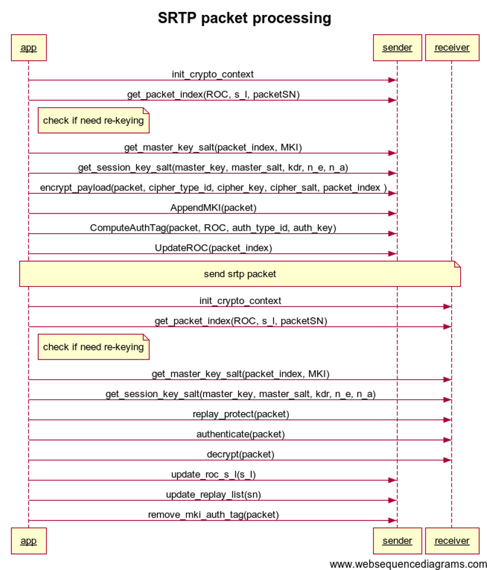

########################
SRTP 协议
########################

.. include:: ../links.ref
.. include:: ../tags.ref
.. include:: ../abbrs.ref

============ ==========================
**Abstract** SRTP protocol
**Authors**  Walter Fan
**Status**   WIP as draft
**Updated**  |date|
============ ==========================

.. contents::
   :local:

概述
=======================

SRTP(Secure Real-time Transport Protocol) 是一个加密协议, 描述了对于 RTP 的加密框架和流程。
在 RFC3711 中有详细的定义, 对实时通信中的 RTP 和 RTCP 进行安全保护。

SRTP 是一个用于加密媒体和验证数据包的框架, 以便可以验证它们是否来自经批准的来源。 它不定义加密方法, 而是支持一系列不同的加密密码和配置。 原始规范 RFC3711 支持多种加密转换, 其他规范已标准化, 例如 RFC7714, 它增加了对 AES Galois/Counter Mode (AES-GCM) 的支持。

这样做的好处是算法可以不断改进和更新,  而框架本身无需改动, 只要应用新的算法就可以了。

SRTP 只加密 RTP 数据包的荷载 payload：即实际的音频或视频数据, 而包头并未加密。
这样做的原因是对包头加密的成本太高, 得不偿失。 例如有些中间节点在数据转发的时候,  需要访问包头的一些字段, 如 payload type, sequence number, 等等, 我们在抓包时也需要检查包头来检查 RTP 包的丢包和延迟。

虽然包头未加密, 但 SRTP 确实通过附加到每个数据包末尾的验证标签来保护整个数据包  (包括 RTP 包头) 的完整性, 接收者可以使用该标签来验证数据包的内容  (包括包头值) 没有以任何方式改变。

因此, SRTP 传输路径中的任何人都可以读取包头, 但是并不能篡改包头, 因为任何更改都会通过验证标签检测到
一旦有人尝试在没有访问流接收器加密密钥的情况下更改包头, 接收者可以立马检测到篡改并拒绝这个 RTP 数据包。

而一些 RTP 扩展头也是不加密的,  例如 audio level 扩展, SFU 可以在不解密的情况下获知音频流音量的大小。

SRTP 不仅保护 RTP 媒体数据包, 还保护 RTCP. 在默认情况下, 为媒体流协商的加密参数适用于 RTP 和 RTCP 流。

SRTP 数据包的格式与 RTP 标记的格式相匹配, 并添加了验证标记。 它被添加到每个 RTP 数据包的末尾, 并包含标头和加密负载的加密哈希。 这允许接收者确保数据包没有被篡改, 包括有效负载和未加密的标头。

一般我们认为是 SRTP 是位于应用层之下的传输层中的加密协议.

Why
=======================

在线会议的参会者可以在会议中讨论一些重大和机密的事项,  用户通常不希望会议内容可以被其他人知晓。 所以对于多媒体的安全加密是实时通信系统的必要条件

一个好的加密系统具有三个要求：

* 防止未经批准的一方在会议正在进行时和稍后的某个时间访问会议中的媒体内容, 造成泄密。
* 防止未经批准的一方将自己的媒体注入正在进行的会议中进行内容篡改。
* 防止未经批准的一方重新注入先前在会议中捕获的有效媒体数据包。

最后一条容易被人忽略, 在银行抢劫的电影中常常会有罪犯把监控摄像机进行循环播放, 以欺骗警卫, 这种方式称为重放攻击, 安全加密系统需要防止这种情况

所以 SRTP 的安全目标是：

* 保护 RTP 和 RTCP 有效负载的机密性
* 保护整个 RTP 和 RTCP 数据包的完整性
* 重放攻击(Replay attack)防护

How
=======================
SRTP 的两个重要特性：

* 保密性 Confidentiality  --> 通过加密 Encryption 来实现
* 完整性 Integrity  --> 通过认证 Authentication 来实现

每个 RTP 和 RTCP 流都有与其关联的所谓加密上下文  (crypto context) 。 这本质上是在发送方加密数据包或在接收方验证和解密数据包所需的状态。 其中一些值是在呼叫建立过程中使用 SDES 或 DTLS-SRTP等密钥管理和交换机制进行协商的, 而其他值从 0 开始, 然后根据接收/发送的数据包随时间而变化。

.. image:: ../_static/srtp_flow.gif

SRTP 的包结构如下：

.. image:: ../_static/srtp_packet.jpg

SRTCP 的包结构如下：

它有三个强制的新字段:
#. E: Encrypt-Flag(1bit)
#. SRTCP index(31 bit)
#. Authenticate tag

一个可选的字段
MKI

推荐使用与 SRTP 相同的加密上下文 crypt context

对于 RTP/RTCP 进行保护的流程大体如下
-----------------------------------------

Sender 发送者
~~~~~~~~~~~~~~~~~~~~~~~~~~~~~~~~~~~~~~~~

#. 如有需要, 重新生成主密钥
#. 从主密钥 master key 中派生会话密钥 session key
#. 加密有效负载 payload
#. 计算验证标签 authenticate tag
#. 更新SRTP包的 payload 为加密内容, 并添加 authenticate tag

Receiver 接收者
~~~~~~~~~~~~~~~~~~~~~~~~~~~~~~~~~~~~~~~~
#. 如有需要, 重新生成主密钥
#. 从主密钥 master key 中派生会话密钥 session key
#. 重放保护 Replay protect
#. 验证数据包 Authenticate packet
#. 解密有效负载
#. 更新 Rollover Count
#. 更新重放列表 replay list
#. 删除 MKI 和验证标签 authenticate tag

crypto context
-----------------------
Crypto context 加密上下文之一是按流、按方向维护的。 因此, 对于加密的双向 RTP 流, 每一方都会维护两个 RTP 加密上下文, 一个用于其发送的流, 一个用于其接收的流。 RTP上下文包括：

#. Encryption Algorithm 加密算法：加密密码和操作方式, 来自密钥管理机制。
#. Authentication Algorithm 认证算法：使用的认证算法, 来自密钥管理机制。
#. Master Key 主密钥：用于从密钥管理机制导出会话密钥的秘密随机位串。
#. Master Salt 主盐：可选地另一个随机位串, 用作从密钥管理机制导出会话密钥和会话盐的一部分。
#. Session key lengths 会话密钥长度 (n_e/n_a)：来自密钥管理机制的用于加密 (n_e) 和身份验证 (n_a) 的会话密钥的长度。
#. Key Derivation Rate 密钥派生率：默认为零的整数值, 但可以选择从密钥管理机制将其设置为 2 的正幂值。 它用于轮换会话密钥。
#. Authentication Tag Length 身份验证标记长度：添加到每个数据包末尾的身份验证标记的长度。 较短的标签需要较少的额外带宽, 但更容易被破坏。 从密钥管理机制来看。
#. Rollover Counter 翻转计数器：一个 32 位无符号值, 从 0 开始, 每次 16 位 RTP 序列号 "翻转"  (例如, 从 65535 转换回 0) 时加 1。 它被附加到实际的 RTP 序列号以创建虚拟 48 位序列号。
#. 最后序列号 (s_l)：一个 16 位值, 接收到的 "最高" RTP 序列号, 其中最高值考虑了值的回绕  (因此 1 将高于 65534, 假设两者都是在相似的时间帧中接收的) 。
#. RTP 重放列表：接收方必须创建并维护最近接收的数据包的索引列表, 以区分迟到的数据包和作为 "重放" 攻击第二次发送的数据包。 这通常实现为 "滑动窗口" , 跟踪最后收到的 N 个数据包的索引, 其中 N 应至少为 64, 但也可以更高。
#. MKI 指示符：一位定义 MKI  (见下文) 是否已协商。 如果存在 MKI 字段, 则会将其附加到 RTP 和 RTCP 数据包中。

RTCP 加密上下文与 RTP 的加密上下文共享, 除去以下不同：

#. 只有发送方需要维护翻转计数器, 因为在 RTCP 中, 相关信息包含在发送给接收方的每个消息中。
#. 每个接收者都会创建和维护一个单独的 RTCP 重放列表。
#. RTCP 有一个单独的会话密钥, 但 master key 和 master salt 通常会与 RTP 加密上下文共享。

密钥的管理和更新
----------------------

密钥过期
~~~~~~~~~~~~~~~~~~~~~~
密钥轮换是 SRTP 规范的一个主要方面, 用于处理主密钥的到期以及用新的主密钥替换的问题。 这对于某些用例来说很重要, 因为无限期地使用单个密钥既会增加其因信令泄漏或其他渠道而受到损害的可能性, 也会增加密钥受到损害时的后果。 因此, SRTP 实际上包括多种机制, 用于确定主密钥何时过期并处理重新生成密钥的情况。

RFC3711 定义了 2^48 个数据包的默认 RTP 密钥生存期。 即使以每秒 1000 个数据包的极高速率, 单个视频流也需要运行 8000 多年才能达到这一点。

因此, 虽然规范将密钥生命周期和轮换定义为 "强制实施" , 但实际上, 正常的视频会议实现中并不会更新密钥。

SRTP 中定义了两种用于密钥生命周期管理的机制：主密钥指示符 (MKI) 和 <FROM, TO> 机制。 这两者是相互排斥的； MKI 在每个数据包中需要额外的字节, 但适用于多流交换机制, 而 <From, To> 仅适用于点对点呼叫。 <From, To> 不能通过重要的密钥管理机制  (例如点对点呼叫中的 SDES) 进行协商, 所以应用很少。

MKI 主密钥指示
~~~~~~~~~~~~~~~~~~~~~~~
MKI 在某些在线会议的实现中可能很有价值, 其中媒体流的源和用于其加密的主密钥在呼叫过程中会发生变化  (例如,  说话的人变了) 。 接收方需要能够识别其接收到的每个数据包的适当加密上下文, 因为这可能因数据包而异。

MKI 通过将 MKI 值附加到每个 RTP 和 RTCP 数据包的有效负载之后、身份验证标记之前来实现此目的。 该字段的大小由密钥管理机制协商。 请注意, 与上述字段不同, MKI 值不包含在身份验证计算中。

数据包的接收方可以检查 MKI 值, 并使用它来确定用于验证和解密数据包的适当的加密上下文。 为此, 接收方需要通过某种信令机制接收到主密钥集和其他值。

MKI 的实际应用并不多, 我们可以让 SFU 重新加密为一致的主密钥, 仅使用 SSRC 来识别相关的加密上下文, 或其他方法, 例如 EKT

SRTP 的信令协商
=======================
根据 RFC4568(SDP) 以及 RFC3830(MIKEY), 我们需要协商以下参数

* 加密套件 Crypto-suite
* 密钥参数 Key parameter

  - Inline: key||salt
  - Lifetime
  - MKI:Length

* 会话参数 Session parameters

  - KDR: key derivation rate
  - UNENCRYPTED_SRTP
  - UNENCRYPTED_SRTP
  - UNAUTHENTICATED_SRTP
  - FEC_ORDER
  - FEC_KEY
  - WSH: window size hint
  - Extension

Security Descriptions in SDP
------------------------------------------------
SRTP 依赖于单独的密钥管理机制来实际协商各种参数, 例如要使用的密码套件、主密钥等。其中, 最常见的参数之一是媒体流安全描述 (SDES) 扩展 SDP, 2006 年在 RFC4568 中定义。 这种机制在 SIP 实现以及某些使用 SDP 的专有信令格式中得到了广泛支持。

例如：

  a=crypto:1 AES_CM_128_HMAC_SHA1_80 inline:d0RmdmcmVCspeEc3QGZiNWpVLFJhQX1cfHAwJSoj|2^20|1:32

格式如下：

.. code-block::

      a=crypto: <tag> <crypto-suite> <key-params> [<session-params>]

* tag：一个正整数值, 用于在 SDP 协商期间标识此特定加密属性。 m= 行中的每个加密属性必须具有不同的标记值。

* crypto-suite：定义要使用的加密套件的字符串, 取自受支持套件的标准化列表。

* Key-params：一个复杂的多部分字符串, 定义套件的键。

* session-params：一个或多个可选的会话参数。 在一些可用于加密/身份验证的 CPU 有限的旧 SIP 设备中偶尔会看到两个 UNAUTHENTICATED_SRTP 和 UNENCRYPTED_SRTCP, 正如预期的那样, 它们分别禁用 SRTP 的身份验证和 SRTCP 的加密。

相对复杂一点的是 Key-params。 对于 SRTP, 以字符串 "inline:" 开头。 下一个元素是主密钥 master key 和主盐 master salt, 它们连接在一起并进行 Base64 编码。 Base 64 编码用于将随机二进制序列编码为 US-ASCII。 加密套件决定密钥和盐的长度； 它们连接在一起, 没有分隔符。

最后有两个可选字段可以添加到 params 字符串的末尾, 并用 "|" 字符分隔。 第一个是生命周期, 即主密钥生命周期, 以正整数值或 2 的幂的格式 "2^N" 表示, 其中 N 是正整数值。 SIP 实现使用两种格式的幂来设置生命周期值的情况并不罕见, 通常在 N=18-22 的范围内, 但实际上第三方并不一定遵守此限制。

第二个是 MKI, 其格式为 "<id>:<length>", 其中 id 是 MKI 的值, length 是 MKI 字段的长度  (以字节为单位) 。

因此 "|1:4" 意味着对于这组参数, MKI 正在使用中, 并且应该附加到 4 字节 MKI 字段中值为 1 的数据包中。 从技术上讲, SDES 允许 "a=crypto" 属性包含具有单独 MKI 的多个主密钥, 但实际上第三方并不一定遵守此限制。

Security Descriptions in DTLS extension(DTLS-SRTP)
-----------------------------------------------------------------

密钥放在 SDP 中,  意味着密钥可能在信令通道中暴露, 因此 WebRTC 使用 DTLS-SRTP 来进行加密参数协议和密钥交换管理。

DTLS-SRTP, 于 2010 年标准化为 RFC5763  (用于 SDP 协商) 和 RFC5764  (用于 DTLS-SRTP 机制) 

DTLS-SRTP 使用 SDP 通过媒体通道在两个远端之间协商 DTLS  (基于 UDP 的 TLS) 连接。 此连接被建立并用作密钥管理系统来协商密码套件、密钥等。然后关闭 DTLS 通道并使用 SRTP 加密媒体。 媒体本身不通过 DTLS 流动。

DTLS-SRTP 的一个重要因素是它的设计使得使用它的设备不需要拥有由知名颁发机构颁发的有效证书, 就像大多数 TLS 用例的情况一样。 相反, 它的设计允许它使用自签名证书或从内部证书签名的证书, 这意味着它通常不会为组织部署增加任何额外的复杂性。

libsrtp
=======================

Reference
========================
* Secure RTP is defined in RFC 3711. The counter mode definition is in Section 4.1.1.
* SHA-1 is defined in FIPS PUB 180-4.
* HMAC is defined in RFC 2104 and HMAC-SHA1 test vectors are available in RFC 2202.
* AES-GCM usage in SRTP is defined in RFC 7714
* https://webrtc-security.github.io/
* https://github.com/gteissier/srtp-decrypt