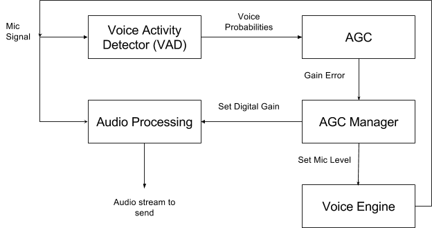

##########################
Automatic Gain Control
##########################

.. include:: ../links.ref
.. include:: ../tags.ref
.. include:: ../abbrs.ref

============ ==========================
**Abstract** Automatic Gain Control
**Authors**  Walter Fan
**Status**   v1.0
**Updated**  |date|
============ ==========================

.. contents::
   :local:

概述
===================

自动增益控制（AGC）是指当直放站工作于最大增益且输出为最大功率时，增加输入信号电平，提高直放站对输出信号电平控制的能力。

自动增益控制主要用于调整音量幅值。

正常人交谈的音量在40~60dB之间，低于25dB的声音听起来很吃力，超过100dB的声音会让人不适。AGC的作用就是将音量调整到人接受的范围。

AGC的调整分为模拟部分(AAGC)和数字部分(DAGC)，模拟部分是麦克风的采集增益，数字部分是音频数据的数字电平调整。

* Calculate the short-term mean and variance, describe the instantaneous change of the voice envelope, which can accurately reflect the voice envelope,

* Calculate the long-term mean and variance, describe the overall slow change trend of the signal, outline the "center of gravity" of the signal, and it is more smooth to use the threshold as the detection condition, such as Figure 2 left blue curve ;

* Calculate the standard score and describe the deviation of the short-term average from the "center of gravity". The part above the center can be considered as having a great possibility of voice activity;

原理
=====================

自动增益控制是指使放大电路的增益自动地随信号强度而调整的自动控制方法。实现这种功能的电路简称AGC环。
AGC环是闭环电子电路，是一个负反馈系统，它可以分成增益受控放大电路和控制电压形成电路两部分。

增益受控放大电路位于正向放大通路，其增益随控制电压而改变。控制电压形成电路的基本部件是 AGC 检波器和低通平滑滤波器，有时也包含门电路和直流放大器等部件。放大电路的输出信号u0 经检波并经滤波器滤除低频调制分量和噪声后，产生用以控制增益受控放大器的电压uc 。当输入信号ui增大时，u0和uc亦随之增大。uc 增大使放大电路的增益下降，从而使输出信号的变化量显著小于输入信号的变化量，达到自动增益控制的目的。

放大电路增益的控制方法有：
①改变晶体管的直流工作状态，以改变晶体管的电流放大系数β。
②在放大器各级间插入电控衰减器。
③用电控可变电阻作放大器负载等。

AGC电路广泛用于各种接收机 ，录音机和测量仪器中，它常被用来使系统的输出电平保持在一定范围内 ，因而也称自动电平控制； 用于话音放大器或收音机时，称为自动音量控制。

信号处理细节
---------------------

AGC 的核心在于对输入信号的电平进行实时估计，并据此计算出合适的增益值。其基本数学模型如下：

设输入信号为 :math:`x(n)` ，增益为 :math:`g(n)` ，则输出信号为：

.. math::

   y(n) = g(n) \cdot x(n)

其中增益 :math:`g(n)` 由信号电平估计值和目标电平共同决定。

增益计算
^^^^^^^^^^^^^^^^^^^^^

增益的计算通常基于信号的电平估计。设目标电平为 :math:`L_{target}` （单位 dBFS），当前信号电平估计为 :math:`L_{est}` ，则所需增益为：

.. math::

   G_{dB} = L_{target} - L_{est}

转换为线性增益：

.. math::

   g = 10^{G_{dB}/20}

为了避免增益突变导致的音频失真，实际应用中需要对增益进行平滑处理。常用的方法是一阶指数平滑滤波器：

.. math::

   g_{smooth}(n) = \alpha \cdot g_{target}(n) + (1 - \alpha) \cdot g_{smooth}(n-1)

其中 :math:`\alpha` 是平滑系数，取值范围为 (0, 1)。

攻击时间与释放时间
^^^^^^^^^^^^^^^^^^^^^^^^^^^^^

AGC 的动态响应由两个关键时间常数决定：

* **攻击时间 (Attack Time)** ：当信号电平突然增大时，AGC 降低增益所需的时间。攻击时间越短，AGC 对突发大信号的响应越快，但过短可能导致音频失真。典型值为 1~10 ms。

* **释放时间 (Release Time)** ：当信号电平降低后，AGC 恢复增益所需的时间。释放时间越短，增益恢复越快，但过短可能导致噪声在语音间隙被放大（"呼吸效应"）。典型值为 50~500 ms。

时间常数与平滑系数的关系为：

.. math::

   \alpha = 1 - e^{-1/(f_s \cdot \tau)}

其中 :math:`f_s` 是采样率， :math:`\tau` 是时间常数（攻击时间或释放时间）。

在实际实现中，攻击和释放使用不同的平滑系数：

.. code-block:: cpp

   if (current_level > smoothed_level) {
       // 攻击阶段：信号变大，快速降低增益
       smoothed_level = attack_alpha * current_level
                      + (1 - attack_alpha) * smoothed_level;
   } else {
       // 释放阶段：信号变小，缓慢恢复增益
       smoothed_level = release_alpha * current_level
                      + (1 - release_alpha) * smoothed_level;
   }

电平估计方法
^^^^^^^^^^^^^^^^^^^^^

信号电平的估计方法直接影响 AGC 的性能：

1. **峰值检测 (Peak Detection)** ：取一段时间窗口内信号的最大绝对值。响应快但对瞬态噪声敏感。

   .. math::

      L_{peak} = \max_{n \in [N-W, N]} |x(n)|

2. **RMS 检测 (Root Mean Square)** ：计算信号的均方根值，更能反映信号的平均能量。

   .. math::

      L_{rms} = \sqrt{\frac{1}{W} \sum_{n=N-W}^{N} x^2(n)}

3. **包络跟踪 (Envelope Following)** ：使用一阶低通滤波器跟踪信号的包络线，兼顾响应速度和平滑性。

AGC 算法分类
=====================

根据不同的设计目标和应用场景，AGC 算法可以分为以下几类：

基于峰值的 AGC (Peak-based AGC)
-----------------------------------

基于峰值的 AGC 通过检测信号的峰值电平来调整增益。其优点是响应速度快，能有效防止信号削波（clipping）。缺点是对瞬态噪声敏感，可能导致增益频繁波动。

适用场景：需要严格防止削波的场合，如数字录音。

基于 RMS 的 AGC (RMS-based AGC)
-----------------------------------

基于 RMS 的 AGC 使用信号的均方根值作为电平估计。RMS 值更能反映信号的感知响度，因此基于 RMS 的 AGC 在主观听感上更加自然。

适用场景：语音通信、音乐播放等对听感要求较高的场合。

包络跟踪 AGC (Envelope-following AGC)
-----------------------------------------

包络跟踪 AGC 使用一阶或多阶低通滤波器来跟踪信号的包络线。它在峰值检测和 RMS 检测之间取得了平衡，既能较快地响应信号变化，又不会对瞬态噪声过于敏感。

WebRTC 中的 AGC 实现主要采用这种方法。

压缩器、限制器与扩展器
-----------------------------------

从动态范围处理的角度，AGC 可以进一步细分为：

* **压缩器 (Compressor)** ：当信号超过阈值时，按一定比率降低增益。比率通常在 2:1 到 10:1 之间。压缩器使得大信号变小，从而缩小动态范围。

* **限制器 (Limiter)** ：压缩比率极高（通常 ≥ 20:1）的压缩器。限制器的作用是确保输出信号不超过某个绝对上限，防止削波和设备损坏。

* **扩展器 (Expander)** ：与压缩器相反，当信号低于阈值时降低增益，使得小信号更小。扩展器常用于噪声门（Noise Gate），在无语音时降低背景噪声。

* **噪声门 (Noise Gate)** ：扩展比率极高的扩展器。当信号低于阈值时，直接将增益降为零（或极低值），完全抑制背景噪声。

WebRTC AGC 实现详解
=========================

WebRTC 中的 AGC 经历了多次迭代，目前主要有三个版本：Legacy AGC、AGC1 和 AGC2。

Legacy AGC (GainControlImpl)
-----------------------------------

Legacy AGC 是 WebRTC 最早的 AGC 实现，位于 ``modules/audio_processing/gain_control_impl.h`` 。它支持三种工作模式：

**模拟模式 (Adaptive Analog)**

模拟模式通过调整麦克风的硬件增益来控制音量。其工作流程为：

1. 分析输入信号的电平
2. 计算目标麦克风增益
3. 通过操作系统 API 调整麦克风的模拟增益
4. 对残余的电平差异进行数字补偿

模拟模式的优点是可以在信号进入 ADC 之前调整增益，从而获得更好的信噪比。缺点是依赖于操作系统和硬件的支持，不同平台的行为可能不一致。

.. code-block:: cpp

   // 模拟增益调整的伪代码
   int recommended_analog_level = agc->stream_analog_level();
   // 将推荐的模拟增益设置到麦克风
   audio_device->SetMicrophoneVolume(recommended_analog_level);

**数字模式 (Adaptive Digital)**

数字模式完全在软件层面调整增益，不依赖硬件。其工作流程为：

1. 对输入信号进行电平估计
2. 根据目标电平计算所需的数字增益
3. 将增益应用到音频数据上
4. 使用限制器防止输出信号削波

数字模式的优点是跨平台一致性好，不依赖硬件。缺点是如果输入信号电平过低，放大后信噪比较差。

**固定数字模式 (Fixed Digital)**

固定数字模式应用一个固定的数字增益，不进行自适应调整。适用于嵌入式设备或已经在硬件层面完成了增益控制的场景。

Legacy AGC 的增益表
^^^^^^^^^^^^^^^^^^^^^^^^^^^^^

Legacy AGC 使用预计算的增益表来加速增益计算。增益表将输入电平映射到输出增益，避免了实时计算的开销：

.. code-block:: cpp

   // 增益表的基本结构
   // gain_table[compression_curve_index][input_level] = output_gain
   static const int16_t kGainTable[kNumCompCurves][kNumLevels];

增益表的生成考虑了以下因素：

* 目标电平 (targetDbFs)
* 压缩增益 (compressionGainDb)
* 压缩曲线的形状

AGC2 (GainController2)
-----------------------------------------

AGC2 是 WebRTC 的现代 AGC 实现，位于 ``modules/audio_processing/agc2/`` 目录下，
顶层类为 ``GainController2``（``AdaptiveDigitalGainController`` 只是其内部的一个子组件）。
相比 Legacy AGC，AGC2 具有更好的音质和更灵活的架构。

AGC2 的处理流水线由以下几个阶段组成：

**1. 固定数字增益阶段 (Fixed Digital Gain)**

在处理流水线的最前端，应用一个可配置的固定增益。这个增益在整个会话期间保持不变，用于补偿已知的系统增益偏差。

.. code-block:: cpp

   // 固定增益配置
   AudioProcessing::Config::GainController2::FixedDigital fixed;
   fixed.gain_db = 0.0f;  // 默认不施加额外增益

**2. 自适应数字增益阶段 (Adaptive Digital Gain)**

自适应增益阶段是 AGC2 的核心，它根据输入信号的特征动态调整增益。该阶段集成了 VAD（语音活动检测）来区分语音和非语音段：

* 在语音段，AGC 正常工作，将语音电平调整到目标电平
* 在非语音段，AGC 保持当前增益不变或缓慢衰减，避免放大背景噪声

VAD 集成的关键代码逻辑：

.. code-block:: cpp

   // VAD 集成的伪代码
   float vad_probability = vad->Analyze(audio_frame);
   if (vad_probability > kVadThreshold) {
       // 语音段：更新电平估计，调整增益
       level_estimator->Update(audio_frame);
       float target_gain = ComputeGain(level_estimator->level(),
                                        target_level_dbfs);
       gain_applier->SetGain(target_gain);
   }
   // 非语音段：保持增益不变

**3. 限制器 (Limiter)**

限制器位于处理流水线的末端，确保输出信号不超过 0 dBFS。AGC2 的限制器采用软拐点（soft knee）设计：

* **拐点 (Knee)** ：限制器开始工作的电平阈值。软拐点意味着在阈值附近，压缩比率逐渐增加，而不是突然跳变，从而减少音频失真。

* **压缩比率 (Ratio)** ：超过阈值后，输入电平每增加 N dB，输出电平只增加 1 dB。限制器的比率通常很高（≥ 10:1）。

**4. 饱和保护器 (Saturation Protector)**

饱和保护器是 AGC2 的一个重要安全机制。它监控信号的峰值电平，当检测到信号接近饱和（0 dBFS）时，会主动降低增益以防止削波：

.. code-block:: cpp

   // 饱和保护的基本逻辑
   float headroom_db = 0.0f - peak_level_dbfs;
   if (headroom_db < kMinHeadroomDb) {
       // 信号接近饱和，降低增益
       gain_reduction_db = kMinHeadroomDb - headroom_db;
       adaptive_gain_db -= gain_reduction_db;
   }

关键参数
-----------------------------------

WebRTC AGC 的关键配置参数如下：

**targetDbFs**

目标电平，单位为 dBFS（分贝满刻度）。取值范围为 -31 到 -3。

* -3 dBFS：目标电平较高，输出音量较大，但削波风险增加
* -31 dBFS：目标电平较低，输出音量较小，但有更大的动态余量
* 推荐值：-3（WebRTC 默认值）

**compressionGainDb**

最大压缩增益，单位为 dB。取值范围为 0 到 90。

* 0 dB：不施加额外增益
* 90 dB：最大增益，适用于极低电平的输入信号
* 推荐值：9 dB（WebRTC 默认值）

**agcMode**

AGC 工作模式，可选值：

* ``kAdaptiveAnalog`` (0)：自适应模拟模式
* ``kAdaptiveDigital`` (1)：自适应数字模式
* ``kFixedDigital`` (2)：固定数字模式

**limiterEnabled**

是否启用限制器。布尔值，默认为 true。强烈建议保持启用，以防止输出信号削波。

处理流水线
-----------------------------------

WebRTC 音频处理模块（APM）中 AGC 的完整处理流水线如下：

::

   输入音频帧 (10ms)
       │
       ▼
   ┌─────────────────┐
   │  电平估计        │ ← 计算输入信号的 RMS 和峰值电平
   └────────┬────────┘
            │
            ▼
   ┌─────────────────┐
   │  VAD 分析        │ ← 判断当前帧是否包含语音
   └────────┬────────┘
            │
            ▼
   ┌─────────────────┐
   │  增益计算        │ ← 根据电平估计和 VAD 结果计算目标增益
   └────────┬────────┘
            │
            ▼
   ┌─────────────────┐
   │  增益平滑        │ ← 对增益进行平滑处理，避免突变
   └────────┬────────┘
            │
            ▼
   ┌─────────────────┐
   │  增益应用        │ ← 将增益乘以音频样本
   └────────┬────────┘
            │
            ▼
   ┌─────────────────┐
   │  限制器          │ ← 防止输出信号超过 0 dBFS
   └────────┬────────┘
            │
            ▼
   输出音频帧

AGC 与其他模块的交互
=========================

在 WebRTC 的音频处理模块（APM）中，AGC 并不是孤立工作的，它与其他音频处理模块有着密切的交互关系。

处理顺序
-----------------------------------

WebRTC APM 中各模块的处理顺序为：

::

   麦克风输入
       │
       ▼
   ┌─────────────────┐
   │  AEC (回声消除)   │
   └────────┬────────┘
            │
            ▼
   ┌─────────────────┐
   │  ANS (噪声抑制)   │
   └────────┬────────┘
            │
            ▼
   ┌─────────────────┐
   │  AGC (增益控制)   │
   └────────┬────────┘
            │
            ▼
   编码发送

这个顺序的设计是有道理的：

1. **AEC 在最前面** ：回声消除需要在信号被其他模块修改之前进行，因为 AEC 需要将近端信号与远端参考信号进行对比。如果信号已经被 AGC 修改了增益，会影响 AEC 的自适应滤波器收敛。

2. **ANS 在 AGC 之前** ：噪声抑制应该在增益控制之前进行。如果先进行 AGC，AGC 可能会将噪声放大到与语音相同的电平，使得后续的噪声抑制更加困难。

3. **AGC 在最后面** ：AGC 在所有信号清理工作完成后进行，确保它调整的是干净的语音信号的电平。

与 VAD 的交互
-----------------------------------

VAD（语音活动检测）对 AGC 的性能至关重要：

* **语音段检测** ：AGC 只在检测到语音活动时更新电平估计和调整增益。这避免了在静音或纯噪声段错误地放大噪声。

* **增益冻结** ：在非语音段，AGC 冻结当前增益值。这意味着当说话者暂停时，背景噪声不会被逐渐放大。

* **VAD 置信度** ：AGC2 使用 VAD 的置信度（概率值）来加权电平估计的更新速度。高置信度时快速更新，低置信度时缓慢更新或不更新。

与电平估计的交互
-----------------------------------

电平估计模块为 AGC 提供输入信号的电平信息：

* **短时电平** ：用于快速响应信号变化，驱动攻击阶段的增益调整
* **长时电平** ：用于确定信号的整体趋势，驱动释放阶段的增益恢复
* **峰值电平** ：用于饱和保护，防止输出信号削波

动态范围压缩
=========================

动态范围压缩是 AGC 的核心技术之一。它通过非线性映射将输入信号的动态范围压缩到一个较小的范围内。

压缩曲线
-----------------------------------

压缩曲线描述了输入电平到输出电平的映射关系。以下是一个典型的压缩曲线示意图：

::

   输出电平 (dBFS)
       │
    0  ┤                              ___________
       │                          ___/
       │                      ___/
   -10 ┤                  ___/  ← 压缩区域 (ratio = 4:1)
       │              ___/
       │          ___/
   -20 ┤      ___/
       │  ___/
       │ /  ← 1:1 线性区域
   -30 ┤/
       │
   -40 ┤
       │
       └──┬────┬────┬────┬────┬────┬────┬──→ 输入电平 (dBFS)
        -60  -50  -40  -30  -20  -10    0

   T = 阈值 (Threshold) = -30 dBFS
   R = 压缩比率 (Ratio) = 4:1
   K = 拐点宽度 (Knee Width) = 10 dB

关键参数说明：

**阈值 (Threshold)**

压缩器开始工作的电平。低于阈值的信号不受影响（1:1 通过），高于阈值的信号被压缩。

**压缩比率 (Ratio)**

输入电平变化量与输出电平变化量的比值。例如，4:1 的比率意味着输入电平每增加 4 dB，输出电平只增加 1 dB。

* 1:1 = 无压缩
* 2:1 ~ 4:1 = 轻度压缩
* 4:1 ~ 10:1 = 中度压缩
* 10:1 ~ 20:1 = 重度压缩
* ≥ 20:1 = 限制器

**拐点 (Knee)**

阈值附近的过渡区域。硬拐点（Hard Knee）在阈值处突然开始压缩，软拐点（Soft Knee）在阈值附近逐渐过渡：

* **硬拐点** ：压缩比率在阈值处突然从 1:1 变为设定值。简单但可能产生可听的失真。
* **软拐点** ：压缩比率在阈值附近的一个范围内逐渐变化。更自然，WebRTC AGC2 采用此方式。

**攻击时间和释放时间**

* **攻击时间** ：信号超过阈值后，压缩器达到目标压缩量所需的时间
* **释放时间** ：信号降到阈值以下后，压缩器恢复到无压缩状态所需的时间

压缩器的输入输出关系可以用以下公式表示（硬拐点情况）：

.. math::

   y_{dB} = \begin{cases}
   x_{dB} & \text{if } x_{dB} < T \\
   T + \frac{x_{dB} - T}{R} & \text{if } x_{dB} \geq T
   \end{cases}

其中 :math:`x_{dB}` 是输入电平， :math:`y_{dB}` 是输出电平， :math:`T` 是阈值， :math:`R` 是压缩比率。

调试与调优
=========================

在实际应用中，AGC 的调优是一个需要反复测试的过程。以下是常见问题和推荐的调优方案。

常见问题
-----------------------------------

**1. 呼吸效应 / 抽吸效应 (Pumping Effect)**

现象：在语音间隙，背景噪声被明显放大，然后在语音开始时又被压下去，产生"呼吸"般的噪声起伏。

原因：释放时间过短，AGC 在语音间隙快速恢复增益，将背景噪声放大。

解决方案：

* 增加释放时间
* 启用 VAD 集成，在非语音段冻结增益
* 在 AGC 之前使用噪声抑制（ANS）降低背景噪声

**2. 削波 (Clipping)**

现象：输出音频出现明显的失真，波形顶部被截断。

原因：增益过大，输出信号超过 0 dBFS。

解决方案：

* 确保限制器已启用 (limiterEnabled = true)
* 降低 targetDbFs（例如从 -3 改为 -6）
* 降低 compressionGainDb

**3. 适应速度慢 (Slow Adaptation)**

现象：说话者从低声切换到正常音量时，AGC 需要很长时间才能调整到合适的增益。

原因：攻击时间过长，或电平估计的平滑系数过大。

解决方案：

* 减小攻击时间
* 使用更激进的电平估计参数

**4. 背景噪声放大 (Background Noise Amplification)**

现象：在安静环境中，AGC 将背景噪声放大到可听的程度。

原因：AGC 试图将所有信号（包括噪声）提升到目标电平。

解决方案：

* 启用 VAD 集成
* 在 AGC 之前使用噪声抑制
* 设置最小信号电平阈值，低于此阈值不进行增益调整

推荐配置
-----------------------------------

**安静房间 (Quiet Room)**

适用于安静的办公室或会议室环境：

.. code-block:: cpp

   // 安静房间推荐配置
   agc_config.targetDbFs = -3;          // 较高的目标电平
   agc_config.compressionGainDb = 9;    // 适中的压缩增益
   agc_config.limiterEnabled = true;    // 启用限制器
   agc_config.agcMode = kAdaptiveDigital;

**嘈杂环境 (Noisy Environment)**

适用于咖啡厅、街道等嘈杂环境：

.. code-block:: cpp

   // 嘈杂环境推荐配置
   agc_config.targetDbFs = -6;          // 稍低的目标电平，留更多余量
   agc_config.compressionGainDb = 6;    // 较低的压缩增益，避免放大噪声
   agc_config.limiterEnabled = true;    // 启用限制器
   agc_config.agcMode = kAdaptiveDigital;
   // 建议同时启用较强的噪声抑制
   ns_config.level = kHigh;

**多人会议 (Conference Call)**

适用于多人参与的视频会议：

.. code-block:: cpp

   // 多人会议推荐配置
   agc_config.targetDbFs = -6;          // 适中的目标电平
   agc_config.compressionGainDb = 12;   // 较高的压缩增益，适应不同说话者
   agc_config.limiterEnabled = true;    // 启用限制器
   agc_config.agcMode = kAdaptiveDigital;
   // 多人场景下建议使用 AGC2
   // AGC2 的 VAD 集成能更好地处理多人交替说话的场景

Glossary
=====================
audio level
--------------------
音频电平，表示音频信号的强度。通常以 dBFS（分贝满刻度）为单位，0 dBFS 表示数字音频系统能表示的最大电平。

single talk
--------------------
单讲，指在通信中只有一方在说话的状态。AGC 在单讲状态下工作最为稳定。

multiple talk
--------------------
双讲/多讲，指通信中多方同时说话的状态。双讲对 AGC 和 AEC 都是挑战，因为信号混叠使得电平估计变得困难。

boost volume
--------------------
增益提升，指通过 AGC 将低电平信号放大到目标电平的过程。

Key points
====================
AAGC/DAGC supported by  

* AGC 的核心是电平估计和增益计算
* 攻击时间和释放时间是 AGC 动态响应的关键参数
* WebRTC 提供了 Legacy AGC 和 AGC2 两种实现
* AGC 应在 AEC 和 ANS 之后处理
* VAD 集成对于避免噪声放大至关重要
* 限制器是防止削波的最后一道防线

WebRTC Implementation
=========================

* Legacy AGC: 基于增益表的传统实现，支持模拟和数字两种模式
* AGC: 改进版本，优化了增益计算算法
* AGC2: 现代实现，采用自适应数字增益和 VAD 集成

Parameters
---------------------------
targetDbFs
  目标电平 (dBFS)，范围 -31 ~ -3，默认 -3

compressionGainDb
  最大压缩增益 (dB)，范围 0 ~ 90，默认 9

agcMode
  工作模式：kAdaptiveAnalog / kAdaptiveDigital / kFixedDigital

limiterEnabled
  是否启用限制器，默认 true

AGC Mode
--------------------------
* Fixed Digital: for embedded devices, applies a constant gain
* Adaptive Analog: adjusts the microphone's analog gain via OS API
* Adaptive Digital: adjusts gain in the digital domain, platform-independent

Legacy AGC
----------------------------
* Calculate Gain Table
* 使用预计算的增益查找表
* 支持三种工作模式
* 增益平滑使用一阶 IIR 滤波器

参考资料
===================
* `WebRTC AGC Testing <https://testing.googleblog.com/2015/10/audio-testing-automatic-gain-control.html>`_
* `WebRTC Audio Quality Testing <https://testing.googleblog.com/2013/11/webrtc-audio-quality-testing.html>`_
* `详解 WebRTC 高音质低延时的背后 — AGC（自动增益控制) <https://segmentfault.com/a/1190000040072259>`_
* WebRTC 源码 - AGC2 实现: ``modules/audio_processing/agc2/``
* WebRTC 源码 - Legacy AGC: ``modules/audio_processing/gain_control_impl.h``
* WebRTC 源码 - APM 配置: ``modules/audio_processing/include/audio_processing.h``
* `Digital Dynamic Range Compressor Design — A Tutorial and Analysis <https://www.eecs.qmul.ac.uk/~josh/documents/2012/GissonisZolzer-DAFx-2012.pdf>`_
* `Audio AGC Algorithm Design <https://www.ti.com/lit/an/spra895/spra895.pdf>`_ — TI Application Note
* ITU-T G.169: Automatic level control devices
* AES Standard: AES17 — Measurement of digital audio equipment
