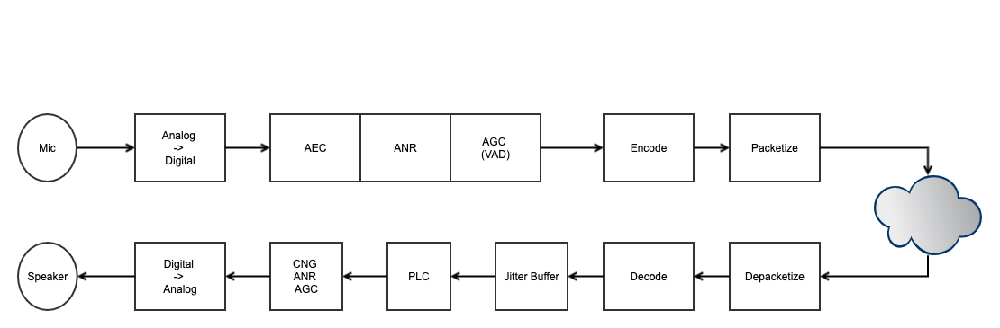

################
WebRTC 音频
################

.. toctree::
   :maxdepth: 1
   :caption: 目录

   audio_basic
   audio_process
   audio_level
   audio_api
   audio_qos
   audio_aec
   audio_vad
   audio_agc
   audio_ans

   ../5.qos/audio_jitter_buffer
   audio_worklet
   audio_quality
   audio_analysis
   audio_codec_opus

.. include:: ../links.ref
.. include:: ../tags.ref
.. include:: ../abbrs.ref

============ ==========================
**Abstract** Web 音频
**Authors**  Walter Fan
**Status**   v1.0
**Updated**  |date|
============ ==========================

.. contents::
   :local:

Overview
===================

WebRTC 的音频处理是一个复杂而精密的系统，涵盖了从音频采集、处理、编码、传输到解码、播放的完整流水线。
一个高质量的实时音频通信系统需要在延迟、质量和带宽之间取得精妙的平衡。

WebRTC 音频流水线的主要环节包括：

* **Audio Capture**: 通过操作系统的音频框架采集麦克风输入
* **Audio Processing (APM)**: 回声消除 (AEC)、噪声抑制 (NS)、自动增益控制 (AGC) 等
* **Audio Encoding**: 使用 Opus 等编解码器压缩音频数据
* **Audio Transport**: 通过 RTP/SRTP 传输音频数据包
* **Audio Decoding & Playout**: 解码、抖动缓冲、丢包隐藏、播放

.. code-block:: text

   ┌──────────┐   ┌──────────┐   ┌──────────┐   ┌──────────┐   ┌──────────┐
   │  Capture  │──▶│   APM    │──▶│ Encoder  │──▶│Transport │──▶│  NetEQ   │
   │ (ADM)    │   │(AEC/NS/  │   │ (Opus)   │   │(RTP/SRTP)│   │+ Decoder │
   │          │   │ AGC/VAD) │   │          │   │          │   │+ Playout │
   └──────────┘   └──────────┘   └──────────┘   └──────────┘   └──────────┘
       ▲                                                             │
       │                                                             ▼
   ┌──────────┐                                                ┌──────────┐
   │Microphone│                                                │ Speaker  │
   └──────────┘                                                └──────────┘

音频采集 (Audio Capture)
============================

音频采集是整个音频流水线的起点。WebRTC 通过 ``AudioDeviceModule (ADM)`` 抽象了不同平台的音频 API，
提供统一的音频采集和播放接口。

平台音频 API
--------------------------

不同操作系统使用不同的底层音频框架：

.. csv-table:: 各平台音频 API
   :header: "平台", "音频 API", "特点"
   :widths: 15, 25, 60

   "macOS", "CoreAudio", "低延迟，支持 AudioUnit，HAL (Hardware Abstraction Layer)"
   "iOS", "CoreAudio + AVAudioSession", "需要管理音频会话类别，处理中断事件"
   "Windows", "WASAPI (Windows Audio Session API)", "Vista+ 默认，支持独占模式和共享模式"
   "Linux", "PulseAudio / ALSA", "PulseAudio 为高层 API，ALSA 为底层 API"
   "Android", "AAudio / OpenSL ES", "AAudio (API 26+) 为推荐方案，低延迟"
   "ChromeOS", "CRAS (Chrome Audio Server)", "Chrome OS 专用音频服务"

AudioDeviceModule (ADM)
--------------------------

``AudioDeviceModule`` 是 WebRTC 音频设备层的核心抽象类，定义了音频采集和播放的统一接口：

.. code-block:: cpp

   class AudioDeviceModule : public rtc::RefCountInterface {
    public:
     // 设备枚举
     virtual int16_t PlayoutDevices() = 0;
     virtual int16_t RecordingDevices() = 0;

     // 设备选择
     virtual int32_t SetPlayoutDevice(uint16_t index) = 0;
     virtual int32_t SetRecordingDevice(uint16_t index) = 0;

     // 初始化采集/播放
     virtual int32_t InitRecording() = 0;
     virtual int32_t InitPlayout() = 0;

     // 开始/停止
     virtual int32_t StartRecording() = 0;
     virtual int32_t StopRecording() = 0;
     virtual int32_t StartPlayout() = 0;
     virtual int32_t StopPlayout() = 0;

     // 注册音频回调
     virtual int32_t RegisterAudioCallback(AudioTransport* audioCallback) = 0;
   };

``AudioTransport`` 接口用于在 ADM 和上层模块之间传递音频数据：

.. code-block:: cpp

   class AudioTransport {
    public:
     // ADM 采集到音频数据后回调此方法
     virtual int32_t RecordedDataIsAvailable(
         const void* audioSamples,
         size_t nSamples,
         size_t nBytesPerSample,
         size_t nChannels,
         uint32_t samplesPerSec,
         uint32_t totalDelayMS,
         int32_t clockDrift,
         uint32_t currentMicLevel,
         bool keyPressed,
         uint32_t& newMicLevel) = 0;

     // ADM 需要播放数据时回调此方法
     virtual int32_t NeedMorePlayData(
         size_t nSamples,
         size_t nBytesPerSample,
         size_t nChannels,
         uint32_t samplesPerSec,
         void* audioSamples,
         size_t& nSamplesOut,
         int64_t* elapsed_time_ms,
         int64_t* ntp_time_ms) = 0;
   };

采样率与声道配置
--------------------------

WebRTC 支持多种采样率和声道配置：

**采样率 (Sample Rate)**:

* **8 kHz**: 窄带 (Narrowband)，电话质量，带宽 300-3400 Hz
* **16 kHz**: 宽带 (Wideband)，VoIP 常用，带宽 50-7000 Hz
* **32 kHz**: 超宽带 (Super-wideband)，带宽 50-14000 Hz
* **48 kHz**: 全带 (Fullband)，最高质量，带宽 20-20000 Hz，Opus 默认采样率

WebRTC 内部的音频处理通常以 **10ms 帧** 为单位。不同采样率下每帧的样本数：

.. csv-table:: 每帧样本数
   :header: "采样率", "每帧样本数 (10ms)", "每帧字节数 (16-bit)"
   :widths: 20, 30, 30

   "8 kHz", "80", "160"
   "16 kHz", "160", "320"
   "32 kHz", "320", "640"
   "48 kHz", "480", "960"

**声道配置 (Channel Configuration)**:

* **单声道 (Mono)**: 语音通话的默认配置，带宽效率最高
* **立体声 (Stereo)**: 音乐传输或空间音频场景，Opus 支持立体声编码

音频处理模块 (Audio Processing Module, APM)
================================================

APM 是 WebRTC 音频质量的核心保障。它对采集到的原始音频进行一系列处理，
以消除回声、抑制噪声、调整增益等。

处理链顺序
--------------------------

APM 的处理链按照特定顺序执行，顺序很重要，因为某些处理依赖于前序处理的结果：

.. code-block:: text

   采集音频 ──▶ HPF ──▶ AEC ──▶ NS ──▶ AGC ──▶ VAD ──▶ 编码器
                │       │       │       │       │
                │       │       │       │       └─ Voice Activity Detection
                │       │       │       └─ Automatic Gain Control
                │       │       └─ Noise Suppression
                │       └─ Acoustic Echo Cancellation
                └─ High-Pass Filter (去除直流偏移和低频噪声)

各处理模块的作用：

1. **HPF (High-Pass Filter)**: 去除 80Hz 以下的低频噪声和直流偏移 (DC offset)
2. **AEC (Acoustic Echo Cancellation)**: 消除扬声器播放的声音被麦克风重新采集产生的回声
3. **NS (Noise Suppression)**: 抑制背景噪声（如风扇声、空调声、交通噪声）
4. **AGC (Automatic Gain Control)**: 自动调整音频增益，使输出音量保持在合适的范围
5. **VAD (Voice Activity Detection)**: 检测语音活动，用于 DTX 和其他模块的决策

AudioProcessing 类与配置
--------------------------

.. code-block:: cpp

   // 创建 AudioProcessing 实例
   rtc::scoped_refptr<AudioProcessing> apm =
       AudioProcessingBuilder().Create();

   // 配置各处理模块
   AudioProcessing::Config config;

   // 回声消除
   config.echo_canceller.enabled = true;
   config.echo_canceller.mobile_mode = false;  // 桌面模式
   // config.echo_canceller.mobile_mode = true;  // 移动设备模式 (AECM)

   // 噪声抑制
   config.noise_suppression.enabled = true;
   config.noise_suppression.level =
       AudioProcessing::Config::NoiseSuppression::kHigh;
   // 级别: kLow, kModerate, kHigh, kVeryHigh

   // 自动增益控制 (AGC1)
   config.gain_controller1.enabled = true;
   config.gain_controller1.mode =
       AudioProcessing::Config::GainController1::kAdaptiveDigital;

   // 自动增益控制 (AGC2) - 更新的实现
   config.gain_controller2.enabled = true;
   config.gain_controller2.adaptive_digital.enabled = true;

   // 高通滤波器
   config.high_pass_filter.enabled = true;

   // 应用配置
   apm->ApplyConfig(config);

10ms 帧处理
--------------------------

APM 以 10ms 为单位处理音频帧。这是 WebRTC 音频处理的基本时间单位：

.. code-block:: cpp

   // 处理采集到的音频帧
   StreamConfig input_config(48000, 1);   // 48kHz, 单声道
   StreamConfig output_config(48000, 1);

   // 设置远端参考信号（用于 AEC）
   apm->ProcessReverseStream(
       far_end_frame,    // 远端（扬声器播放的）音频
       reverse_input_config,
       reverse_output_config,
       far_end_frame);

   // 处理近端采集的音频
   apm->ProcessStream(
       near_end_frame,   // 近端（麦克风采集的）音频
       input_config,
       output_config,
       near_end_frame);  // 处理后的音频（原地修改）

多声道处理
--------------------------

APM 支持多声道音频处理，但某些模块（如 AEC）在多声道模式下的行为有所不同：

.. code-block:: cpp

   // 立体声配置
   StreamConfig stereo_config(48000, 2);  // 48kHz, 立体声

   // 多声道处理时，AEC 通常对每个声道独立处理
   // 或者先混合为单声道进行 AEC，再应用到各声道

音频编码 (Audio Encoding)
============================

支持的编解码器
--------------------------

WebRTC 支持多种音频编解码器，其中 Opus 是首选：

.. csv-table:: WebRTC 支持的音频编解码器
   :header: "编解码器", "采样率", "码率范围", "特点"
   :widths: 15, 20, 20, 45

   "Opus", "8-48 kHz", "6-510 kbps", "必须支持，自适应码率，支持 FEC/DTX"
   "G.711 μ-law", "8 kHz", "64 kbps", "PCM 编码，无压缩，兼容 PSTN"
   "G.711 A-law", "8 kHz", "64 kbps", "PCM 编码，无压缩，兼容 PSTN"
   "G.722", "16 kHz", "48/56/64 kbps", "宽带编码，子带 ADPCM"
   "iLBC", "8 kHz", "13.3/15.2 kbps", "低码率，抗丢包性好"

Opus 编码器配置
--------------------------

Opus 是 WebRTC 的首选音频编解码器，具有极高的灵活性：

.. code-block:: cpp

   // Opus 编码器关键参数
   struct OpusEncoderConfig {
     int sample_rate = 48000;      // 采样率
     int channels = 1;             // 声道数
     int bitrate = 32000;          // 目标码率 (bps)
     int complexity = 9;           // 编码复杂度 (0-10)
     bool dtx_enabled = true;      // 不连续传输
     bool fec_enabled = true;      // 前向纠错
     int packet_loss_perc = 0;     // 预期丢包率 (0-100)
     int max_playback_rate = 48000; // 最大播放采样率
   };

**关键参数说明**:

* **bitrate**: Opus 支持 6kbps 到 510kbps 的码率范围。语音通话通常使用 16-32kbps，
  音乐传输可能需要 64-128kbps。

* **complexity**: 编码复杂度从 0（最快）到 10（最慢但质量最好）。
  移动设备通常使用 5-7，桌面设备使用 9-10。复杂度 >= 7 时启用 RNN VAD。

* **FEC (Forward Error Correction)**: Opus 内置的前向纠错机制。
  启用后，编码器会在当前包中嵌入前一帧的低码率冗余编码。
  当检测到丢包时，解码器可以使用冗余数据恢复丢失的帧。

* **DTX (Discontinuous Transmission)**: 在静音期间停止发送数据包，
  仅周期性发送舒适噪声参数。可节省约 30-50% 的带宽。

.. code-block:: cpp

   // 通过 AudioEncoder 接口配置 Opus
   AudioEncoderOpusConfig opus_config;
   opus_config.frame_size_ms = 20;        // 帧大小: 10/20/40/60ms
   opus_config.num_channels = 1;
   opus_config.bitrate_bps = 32000;
   opus_config.fec_enabled = true;
   opus_config.dtx_enabled = true;
   opus_config.complexity = 9;

   auto encoder = AudioEncoderOpus::MakeAudioEncoder(opus_config, payload_type);

AudioEncoder 接口
--------------------------

``AudioEncoder`` 是 WebRTC 音频编码器的抽象接口：

.. code-block:: cpp

   class AudioEncoder {
    public:
     struct EncodedInfo {
       size_t encoded_bytes;
       uint32_t encoded_timestamp;
       int payload_type;
       bool speech;           // VAD 判定结果
       bool send_even_if_empty;  // DTX 相关
     };

     // 编码一帧音频
     EncodedInfo Encode(uint32_t rtp_timestamp,
                        rtc::ArrayView<const int16_t> audio,
                        rtc::Buffer* encoded);

     // 设置目标码率
     void OnReceivedTargetAudioBitrate(int target_bps);

     // 设置预期丢包率（影响 FEC）
     void SetProjectedPacketLossRate(double fraction);
   };

音频传输 (Audio Transport)
============================

RTP 封包
--------------------------

编码后的音频数据通过 RTP (Real-time Transport Protocol) 进行封包和传输：

.. code-block:: text

    0                   1                   2                   3
    0 1 2 3 4 5 6 7 8 9 0 1 2 3 4 5 6 7 8 9 0 1 2 3 4 5 6 7 8 9 0 1
   +-+-+-+-+-+-+-+-+-+-+-+-+-+-+-+-+-+-+-+-+-+-+-+-+-+-+-+-+-+-+-+-+
   |V=2|P|X|  CC   |M|     PT      |       Sequence Number         |
   +-+-+-+-+-+-+-+-+-+-+-+-+-+-+-+-+-+-+-+-+-+-+-+-+-+-+-+-+-+-+-+-+
   |                           Timestamp                           |
   +-+-+-+-+-+-+-+-+-+-+-+-+-+-+-+-+-+-+-+-+-+-+-+-+-+-+-+-+-+-+-+-+
   |                             SSRC                              |
   +-+-+-+-+-+-+-+-+-+-+-+-+-+-+-+-+-+-+-+-+-+-+-+-+-+-+-+-+-+-+-+-+
   |                         Opus Payload                          |
   |                             ...                               |
   +-+-+-+-+-+-+-+-+-+-+-+-+-+-+-+-+-+-+-+-+-+-+-+-+-+-+-+-+-+-+-+-+

音频 RTP 包的特点：

* **Timestamp**: 以采样率为单位递增。Opus 使用 48kHz，每 20ms 帧递增 960
* **Payload Type**: 动态分配，通过 SDP 协商
* **Marker bit**: 在静音期后的第一个语音包中设置

SRTP 加密
--------------------------

WebRTC 强制要求使用 SRTP (Secure RTP) 对音频数据进行加密：

* 使用 DTLS-SRTP 密钥交换机制
* 支持 AES-128-CM 和 AES-256-CM 加密算法
* HMAC-SHA1 用于消息认证
* 每个 RTP 包独立加密，不影响实时性

RED 冗余编码
--------------------------

RED (Redundant Audio Data, RFC 2198) 在每个 RTP 包中携带前一帧的冗余编码，
提供额外的丢包恢复能力：

.. code-block:: text

   RTP Packet N:
   ┌─────────────────────────────────┐
   │ Primary: Frame N (Opus, 32kbps) │
   │ Redundant: Frame N-1 (Opus, 低码率) │
   └─────────────────────────────────┘

当 Packet N-1 丢失时，可以从 Packet N 中的冗余数据恢复 Frame N-1。
RED 与 Opus FEC 可以同时使用，提供双重保护。

Transport-CC
--------------------------

Transport-CC (Transport-wide Congestion Control) 也适用于音频流：

* 接收端为每个收到的 RTP 包记录到达时间
* 定期通过 RTCP Transport-CC feedback 报告给发送端
* 发送端据此估计网络带宽和延迟变化
* 音频流的码率可以据此进行自适应调整

音频解码与播放 (Audio Decoding & Playout)
=============================================

NetEQ
--------------------------

NetEQ 是 WebRTC 音频接收端的核心组件，集成了抖动缓冲 (Jitter Buffer)、
解码器 (Decoder)、丢包隐藏 (PLC) 和时间伸缩 (Time-stretching) 等功能：

.. code-block:: text

   RTP Packets ──▶ ┌──────────────────────────────────────┐
                   │              NetEQ                     │
                   │                                        │
                   │  ┌──────────┐  ┌─────────┐  ┌──────┐ │
                   │  │ Jitter   │─▶│ Decoder │─▶│ PLC  │ │ ──▶ 播放
                   │  │ Buffer   │  │         │  │      │ │
                   │  └──────────┘  └─────────┘  └──────┘ │
                   │       │                        │      │
                   │       ▼                        ▼      │
                   │  ┌──────────┐          ┌──────────┐  │
                   │  │ Delay    │          │ Time     │  │
                   │  │ Manager  │          │ Stretch  │  │
                   │  └──────────┘          └──────────┘  │
                   └──────────────────────────────────────┘

**Jitter Buffer**: 缓冲接收到的 RTP 包，吸收网络抖动。缓冲区大小动态调整：

* 抖动大时增大缓冲区（增加延迟但减少丢包）
* 抖动小时减小缓冲区（降低延迟）

**Decoder**: 调用对应编解码器的解码器还原音频 PCM 数据。

**PLC (Packet Loss Concealment)**: 当数据包丢失时，生成替代音频以掩盖丢包：

* 利用前一帧的信息进行外推
* Opus 解码器内置 PLC 功能
* NetEQ 也有自己的 PLC 算法作为后备

**Time-stretching**: 通过时间伸缩算法调整播放速度，以适应抖动缓冲区的目标延迟：

* **加速播放 (Accelerate)**: 当缓冲区过满时，加速播放以减少延迟
* **减速播放 (Pre-empt Expand)**: 当缓冲区过空时，减速播放以避免欠载

PLC (Packet Loss Concealment)
================================

一般方法
-----------------------------
PLC(Packet Loss concealment): 包丢失隐藏，是一种在VOIP通信中最小化语音数据包丢失带来的影响的技术。目前的PLC主要有三种技术：

* Zero insertion(插入零或者静音包)：丢失的语音帧使用0代替。这样虽然解决带来丢失的语音帧，但是带来的后果是通话的静音现象；
* Waveform substitution(波形替换)：丢失的语音帧使用已经接收到的语音进行替换（因为语音在比较短的时间内是相对固定的）。最简单的是使用上一次接收到的语音帧进行替换；
* Model-based methods（基于模型的方法）：引入了一些算法，这些算法利用语音的内插和外插间隙的特性产生语音帧，取代丢失的语音帧；这种方法比较复杂。

处理算法
--------------------------
* replace the packet by mute signal (not good)
* repeat last packet
* interpolate samples by last packet and next packet

**Opus PLC**

Opus 编解码器内置了高质量的 PLC 算法。当解码器检测到丢包时（传入 NULL 数据），
会基于前一帧的频谱信息生成替代帧：

.. code-block:: cpp

   // Opus PLC 使用
   int decoded_samples = opus_decode(
       decoder,
       nullptr,  // NULL 表示丢包
       0,        // 长度为 0
       pcm_output,
       frame_size,
       0);       // 不使用 FEC

   // 使用 FEC 恢复（如果可用）
   int decoded_samples = opus_decode(
       decoder,
       next_packet_data,  // 下一个包的数据
       next_packet_len,
       pcm_output,
       frame_size,
       1);       // 使用 FEC

音频路由与混音 (Audio Routing & Mixing)
==========================================

AudioMixer
--------------------------

在多方会议中，``AudioMixer`` 负责将多路音频流混合为一路输出：

.. code-block:: cpp

   class AudioMixer : public rtc::RefCountInterface {
    public:
     class Source {
      public:
       enum class AudioFrameInfo {
         kNormal,  // 正常音频帧
         kMuted,   // 静音帧
         kError,   // 错误
       };
       virtual AudioFrameInfo GetAudioFrameWithInfo(
           int sample_rate_hz, AudioFrame* audio_frame) = 0;
     };

     // 添加/移除音频源
     virtual bool AddSource(Source* audio_source) = 0;
     virtual void RemoveSource(Source* audio_source) = 0;

     // 混合所有源，输出混合后的音频帧
     virtual void Mix(size_t number_of_channels,
                      AudioFrame* audio_frame_for_mixing) = 0;
   };

混音算法的关键考虑：

* **溢出保护**: 多路音频相加可能导致数值溢出，需要进行削波 (clipping) 或归一化
* **活跃说话人选择**: 通常只混合最活跃的 3-4 路音频，避免过多噪声叠加
* **自己的声音排除**: 发送给每个参与者的混音中不包含其自己的音频

AudioTrack 与 AudioSource
--------------------------

在 WebRTC 的 PeerConnection API 中，音频通过 ``AudioTrack`` 和 ``AudioSource`` 管理：

.. code-block:: cpp

   // 创建音频源
   rtc::scoped_refptr<AudioSourceInterface> audio_source =
       peer_connection_factory->CreateAudioSource(cricket::AudioOptions());

   // 创建音频轨道
   rtc::scoped_refptr<AudioTrackInterface> audio_track =
       peer_connection_factory->CreateAudioTrack("audio_track", audio_source);

   // 添加到 PeerConnection
   auto result = peer_connection->AddTrack(audio_track, {"stream_id"});

JavaScript API
============================

getUserMedia 音频采集
--------------------------

.. code-block:: javascript

   // 基本音频采集
   const stream = await navigator.mediaDevices.getUserMedia({
     audio: true
   });

   // 带约束的音频采集
   const stream = await navigator.mediaDevices.getUserMedia({
     audio: {
       // 回声消除
       echoCancellation: { ideal: true },
       // 自动增益控制
       autoGainControl: { ideal: true },
       // 噪声抑制
       noiseSuppression: { ideal: true },
       // 采样率
       sampleRate: { ideal: 48000 },
       // 声道数
       channelCount: { ideal: 1 },
       // 指定设备
       deviceId: { exact: 'specific-device-id' },
     }
   });

MediaStreamTrack 约束
--------------------------

.. code-block:: javascript

   const audioTrack = stream.getAudioTracks()[0];

   // 获取当前约束
   const constraints = audioTrack.getConstraints();
   console.log('Current constraints:', constraints);

   // 获取当前设置
   const settings = audioTrack.getSettings();
   console.log('Sample rate:', settings.sampleRate);
   console.log('Channel count:', settings.channelCount);
   console.log('Echo cancellation:', settings.echoCancellation);

   // 动态修改约束
   await audioTrack.applyConstraints({
     echoCancellation: true,
     noiseSuppression: true,
     autoGainControl: true,
   });

   // 获取设备能力
   const capabilities = audioTrack.getCapabilities();
   console.log('Supported sample rates:', capabilities.sampleRate);

Web Audio API 集成
--------------------------

WebRTC 的音频流可以与 Web Audio API 集成，实现更复杂的音频处理：

.. code-block:: javascript

   // 创建 AudioContext
   const audioContext = new AudioContext({ sampleRate: 48000 });

   // 将 MediaStream 连接到 Web Audio API
   const source = audioContext.createMediaStreamSource(stream);

   // 创建处理节点
   const gainNode = audioContext.createGain();
   gainNode.gain.value = 1.5;  // 增益 1.5 倍

   const analyser = audioContext.createAnalyser();
   analyser.fftSize = 2048;

   // 连接处理链
   source.connect(gainNode);
   gainNode.connect(analyser);

   // 将处理后的音频输出到 MediaStream
   const destination = audioContext.createMediaStreamDestination();
   gainNode.connect(destination);

   // 使用处理后的流替换原始流
   const processedTrack = destination.stream.getAudioTracks()[0];
   const sender = peerConnection.getSenders().find(s => s.track.kind === 'audio');
   await sender.replaceTrack(processedTrack);

AudioWorklet
--------------------------

``AudioWorklet`` 提供了在独立线程中进行自定义音频处理的能力：

.. code-block:: javascript

   // audio-processor.js (AudioWorklet 处理器)
   class AudioProcessor extends AudioWorkletProcessor {
     process(inputs, outputs, parameters) {
       const input = inputs[0];
       const output = outputs[0];

       for (let channel = 0; channel < input.length; channel++) {
         const inputChannel = input[channel];
         const outputChannel = output[channel];

         for (let i = 0; i < inputChannel.length; i++) {
           // 自定义音频处理
           outputChannel[i] = inputChannel[i];
         }
       }
       return true;  // 继续处理
     }
   }
   registerProcessor('audio-processor', AudioProcessor);

   // 主线程中使用
   await audioContext.audioWorklet.addModule('audio-processor.js');
   const workletNode = new AudioWorkletNode(audioContext, 'audio-processor');
   source.connect(workletNode);
   workletNode.connect(destination);

音频统计监控
========================

通过 WebRTC Stats API 可以监控音频质量：

.. code-block:: javascript

   async function monitorAudioStats(pc) {
     const stats = await pc.getStats();
     stats.forEach(report => {
       // 发送端统计
       if (report.type === 'outbound-rtp' && report.kind === 'audio') {
         console.log('Bytes sent:', report.bytesSent);
         console.log('Packets sent:', report.packetsSent);
         console.log('NACK count:', report.nackCount);
       }

       // 接收端统计
       if (report.type === 'inbound-rtp' && report.kind === 'audio') {
         console.log('Bytes received:', report.bytesReceived);
         console.log('Packets received:', report.packetsReceived);
         console.log('Packets lost:', report.packetsLost);
         console.log('Jitter:', report.jitter);
         console.log('Concealed samples:', report.concealedSamples);
         console.log('Total samples received:', report.totalSamplesReceived);

         // 丢包隐藏比例
         const concealmentRatio =
           report.concealedSamples / report.totalSamplesReceived;
         console.log('Concealment ratio:', concealmentRatio);
       }

       // 音频电平
       if (report.type === 'media-source' && report.kind === 'audio') {
         console.log('Audio level:', report.audioLevel);
         console.log('Total audio energy:', report.totalAudioEnergy);
       }
     });
   }

Reference
===================
* `RFC7874`_ "WebRTC Audio Codec and Processing Requirements"
* `RFC 6716`_ "Definition of the Opus Audio Codec"
* `RFC 7587`_ "RTP Payload Format for the Opus Speech and Audio Codec"
* `RFC 2198`_ "RTP Payload for Redundant Audio Data"
* `RFC 3389`_ "Real-time Transport Protocol (RTP) Payload for Comfort Noise (CN)"
* `RFC 6464`_ "A Real-time Transport Protocol (RTP) Header Extension for Client-to-Mixer Audio Level Indication"
* http://en.wikipedia.org/wiki/Packet_loss_concealment
* https://source.chromium.org/chromium/chromium/src/+/main:third_party/webrtc/modules/audio_processing/
* https://source.chromium.org/chromium/chromium/src/+/main:third_party/webrtc/modules/audio_coding/neteq/
* https://developer.mozilla.org/en-US/docs/Web/API/Web_Audio_API
* https://developer.mozilla.org/en-US/docs/Web/API/AudioWorklet
