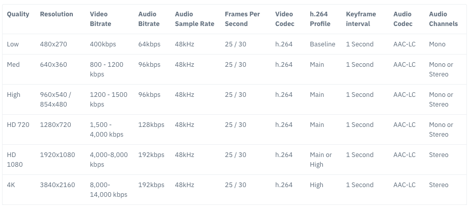

################################
Google REMB
################################

.. include:: ../links.ref
.. include:: ../tags.ref
.. include:: ../abbrs.ref

============ ==========================
**Abstract** Google REMB
**Authors**  Walter Fan
**Status**   v1.0
**Updated**  |date|
============ ==========================

.. contents::
   :local:

概述
==================================================

`Receiver Estimated Max Bitrate (REMB) <https://tools.ietf.org/html/draft-alvestrand-rmcat-remb-03>`_ 是 Google 提出的一种基于接收端的带宽估计方案。
它通过 RTCP 反馈消息，由接收方告诉发送方它估计的最大可接收比特率。

REMB 的核心思想是：接收端通过观察到达数据包的时间间隔变化（delay gradient），利用统计滤波器估计当前网络路径的可用带宽，
然后将估计结果封装在一个 RTCP PSFB（Payload-Specific Feedback）消息中发送给发送端。
发送端收到 REMB 消息后，应将其发送码率调整到不超过 REMB 中指示的比特率。

REMB 曾经是 WebRTC 中默认的带宽估计方案，但随着 Transport-CC（Transport-wide Congestion Control）的成熟，
REMB 已逐渐被取代。不过，理解 REMB 的工作原理对于深入掌握 WebRTC 的拥塞控制机制仍然非常重要。

REMB 定义在 `draft-alvestrand-rmcat-remb <https://tools.ietf.org/html/draft-alvestrand-rmcat-remb-03>`_ 中，
该草案虽然从未成为正式 RFC，但在 WebRTC 的早期版本中被广泛实现和使用。

1) What — REMB 是什么？
==================================================

REMB 是一种 RTCP 反馈消息，属于 PSFB（Payload-Specific Feedback）类型。
根据 `RFC4585`_ 中的定义，其 Payload Type 为 206，FMT（Feedback Message Type）为 15，
表示这是一个应用层反馈（Application Layer Feedback）消息。

它描述了接收方对当前 RTP 会话中所有媒体流的总可用带宽的估计值。
该反馈消息用于通知一个在同一 RTP 会话上有多个媒体流的发送方，
在该 RTP 会话的接收方路径上的总的估计可用比特率。

在用于反馈消息的公共数据包头中（如 `RFC4585`_ 的 6.1 节所定义），
"数据包发送者的 SSRC" 字段指示通知的来源。
不使用 "媒体源的 SSRC"，并且应将其设置为 0。在其他 RFC 中也使用零值。

媒体发送方对符合此规范的 REMB 消息的接收将导致该消息在 RTP 会话上发送的总比特率等于或低于此消息中的比特率。
新的比特率限制应尽快应用。发送者可以根据自己的限制和估计自由应用其他带宽限制。

REMB 的关键特征
----------------------------

- **接收端估计（Receiver-side estimation）**: 带宽估计的计算在接收端完成
- **聚合反馈（Aggregated feedback）**: 一个 REMB 消息覆盖同一 RTP 会话中的所有媒体流
- **绝对值反馈（Absolute value feedback）**: 直接告知发送端可用的最大比特率
- **基于延迟梯度（Delay gradient based）**: 通过观察包到达时间的变化来推断网络状况

2) Why — 为什么要有 REMB？
==================================================

发送者不知道接收方的带宽情况，它需要有一个机制由接收方告诉它有多少带宽可供传输，
这样发送方可以根据这个估计的带宽来调整分辨率（90p, 180p, 360p, 720p 等）和帧率（每秒 24, 30, 40, 60 帧等）。

在实时通信中，如果发送端的码率超过了网络路径的可用带宽，就会导致：

- **丢包（Packet loss）**: 路由器缓冲区溢出，数据包被丢弃
- **延迟增加（Increased delay）**: 数据包在路由器缓冲区中排队等待
- **抖动增大（Increased jitter）**: 排队延迟的变化导致包到达时间不均匀
- **质量下降（Quality degradation）**: 丢包和延迟导致音视频质量严重下降

因此，需要一种机制让接收端将其观察到的网络状况反馈给发送端，
使发送端能够自适应地调整编码参数，在可用带宽范围内提供最佳的音视频质量。

      不同分辨率所使用的带宽

3) How — REMB 的实现原理
==================================================

SDP 协商
----------------------------

在 SDP（Session Description Protocol）中，REMB 的支持通过以下属性声明：

.. code-block::

    a=rtcp-fb:<payload type> goog-remb
    a=extmap:3 http://www.webrtc.org/experiments/rtp-hdrext/abs-send-time

其中：

- ``a=rtcp-fb:<payload type> goog-remb`` 声明该 payload type 支持 REMB 反馈
- ``a=extmap:3 ...abs-send-time`` 声明使用 Absolute Send Time 头扩展，这是 REMB 估计所依赖的时间戳信息

如果 SDP Offer/Answer 双方都声明了 ``goog-remb``，则 REMB 机制被启用。
接收端会开始进行带宽估计，并定期发送 REMB 消息给发送端。

REMB 数据包格式
----------------------------

REMB 消息的 RTCP 数据包格式如下：

- 首先看它的 Payload Type，206 意谓 PSFB 即荷载特定的反馈 Payload-specific Feedback，
  参见 `RFC5104`_ Codec Control Feedback 编码层反馈
- 其次看它的 FMT type，15 意谓应用层反馈 Application layer feedback
- 然后看它的 Unique Identifier 唯一标识符 "REMB"
- 最后看相关的 SSRC number，即 RTP 流个数，计算估计出带宽为 ``mantissa * 2 ^ exp``

.. code-block::

    0                   1                   2                   3
    0 1 2 3 4 5 6 7 8 9 0 1 2 3 4 5 6 7 8 9 0 1 2 3 4 5 6 7 8 9 0 1
   +-+-+-+-+-+-+-+-+-+-+-+-+-+-+-+-+-+-+-+-+-+-+-+-+-+-+-+-+-+-+-+-+
   |V=2|P| FMT=15  |   PT=206      |             length            |
   +-+-+-+-+-+-+-+-+-+-+-+-+-+-+-+-+-+-+-+-+-+-+-+-+-+-+-+-+-+-+-+-+
   |                  SSRC of packet sender                        |
   +-+-+-+-+-+-+-+-+-+-+-+-+-+-+-+-+-+-+-+-+-+-+-+-+-+-+-+-+-+-+-+-+
   |                  SSRC of media source (unused) = 0            |
   +-+-+-+-+-+-+-+-+-+-+-+-+-+-+-+-+-+-+-+-+-+-+-+-+-+-+-+-+-+-+-+-+
   |  Unique identifier 'R' 'E' 'M' 'B'                            |
   +-+-+-+-+-+-+-+-+-+-+-+-+-+-+-+-+-+-+-+-+-+-+-+-+-+-+-+-+-+-+-+-+
   |  Num SSRC     | BR Exp    |  BR Mantissa                      |
   +-+-+-+-+-+-+-+-+-+-+-+-+-+-+-+-+-+-+-+-+-+-+-+-+-+-+-+-+-+-+-+-+
   |   SSRC feedback 1                                             |
   +-+-+-+-+-+-+-+-+-+-+-+-+-+-+-+-+-+-+-+-+-+-+-+-+-+-+-+-+-+-+-+-+
   |   SSRC feedback 2                                             |
   +-+-+-+-+-+-+-+-+-+-+-+-+-+-+-+-+-+-+-+-+-+-+-+-+-+-+-+-+-+-+-+-+
   |  ...                                                          |

字段含义详解
----------------------------

* **版本 Version (V)** (2 bits): RTP 当前的版本为 2。

* **是否填充 Padding (P)** (1 bit): 如果设置，表示数据包末尾包含额外的填充字节，这些字节不属于控制信息但包含在长度字段中。通常为 0。

* **反馈消息类型 Feedback Message Type (FMT)** (5 bits): 标识反馈消息的类型。对于 REMB，固定为 15，表示应用层反馈消息。参见 `RFC 4585 section 6.4 <https://tools.ietf.org/html/rfc4585#section-6.4>`_。

* **荷载类型 Payload Type (PT)** (8 bits): RTCP 包类型，标识该包为 RTCP FB 消息。对于 REMB，固定为 PSFB (206)，表示 Payload-specific FB 消息。

* **长度 Length** (16 bits): 这个包的总长度（以 32-bit 字为单位）减 1，包括包头和填充值。

* **包发送者的 SSRC (SSRC of packet sender)** (32 bits): 发送此 RTCP 包的源的同步源标识符。

* **媒体源的 SSRC (SSRC of media source)** (32 bits): 固定为 0，与 `RFC5104`_ section 4.2.2.2 (TMMBN) 中的约定一致。

* **唯一标识符 Unique Identifier** (32 bits): 固定为 'R' 'E' 'M' 'B' (4 个 ASCII 字符)，用于区分 REMB 消息和其他 FMT=15 的消息。

* **同步源个数 Num SSRC** (8 bits): 此消息中包含的 SSRC 数量。

* **带宽指数 BR Exp** (6 bits): 最大总媒体比特率值的尾数的指数缩放因子，忽略所有包开销。值为无符号整数 [0..63]。

* **带宽尾数 BR Mantissa** (18 bits): 最大总媒体比特率的尾数（忽略所有包开销）。

* **反馈 SSRC (SSRC feedback)** (32 bits each): 一个或多个此反馈消息所适用的 SSRC 条目。

最终计算出来的带宽估计为：

.. math::

    \text{receiver-bit-rate} = \text{mantissa} \times 2^{\text{exp}}

**比特率编码示例**:

假设估计带宽为 1,500,000 bps (1.5 Mbps)：

- 将 1500000 表示为 mantissa × 2^exp 的形式
- 1500000 ≈ 5722 × 2^8 (5722 × 256 = 1464832，近似)
- 或者更精确地：1500000 = 5859 × 2^8 (5859 × 256 = 1499904)
- 此时 BR Exp = 8, BR Mantissa = 5859

4) 接收端带宽估计算法
==================================================

REMB 的核心在于接收端的带宽估计算法。该算法基于 Google Congestion Control (GCC) 的接收端部分，
主要包含以下几个关键组件：

到达时间模型（Arrival Time Model）
----------------------------------------------

接收端通过比较相邻数据包组（packet group）的发送时间间隔和到达时间间隔来计算延迟梯度（delay gradient）：

.. code-block::

   发送时间间隔: dS = S(i) - S(i-1)    (通过 abs-send-time 头扩展获取)
   到达时间间隔: dR = R(i) - R(i-1)    (接收端本地时钟测量)
   延迟梯度:     dm = dR - dS          (单向延迟变化量)

其中：

- ``S(i)`` 是第 i 个包组的发送时间
- ``R(i)`` 是第 i 个包组的到达时间
- ``dm`` 为正值表示网络排队延迟在增加（可能拥塞），为负值表示排队延迟在减少

在 WebRTC 源码中，这部分由 ``InterArrival`` 类实现，它负责：

- 将到达的 RTP 包按时间戳分组
- 计算相邻包组之间的发送时间差和到达时间差
- 输出延迟梯度供后续模块使用

卡尔曼滤波器（Kalman Filter）
----------------------------------------------

原始的延迟梯度信号包含大量噪声，需要通过滤波器进行平滑处理。
REMB 使用自适应卡尔曼滤波器（Adaptive Kalman Filter）来估计网络排队延迟的趋势。

滤波器的状态方程为：

.. math::

    d(i) = d(i-1) + w(i)

其中 ``d(i)`` 是估计的网络排队延迟，``w(i)`` 是过程噪声。

观测方程为：

.. math::

    m(i) = d(i) + v(i)

其中 ``m(i)`` 是观测到的延迟梯度，``v(i)`` 是测量噪声。

在 WebRTC 源码中，这部分由 ``OveruseEstimator`` 类实现，它维护：

- 状态估计值（estimated delay）
- 估计误差协方差（estimation error covariance）
- 过程噪声协方差（process noise covariance）
- 测量噪声方差（measurement noise variance），会根据残差自适应调整

过载检测器（Overuse Detector）
----------------------------------------------

过载检测器根据卡尔曼滤波器输出的估计延迟值，判断当前网络处于哪种状态：

- **Overuse（过载）**: 估计延迟持续超过自适应阈值，表示网络拥塞
- **Underuse（欠载）**: 估计延迟持续低于阈值的负值，表示网络有空余容量
- **Normal（正常）**: 估计延迟在阈值范围内

自适应阈值（Adaptive Threshold）是 REMB 算法的一个重要改进。
固定阈值在不同网络条件下表现不佳，自适应阈值会根据网络状况动态调整：

.. code-block::

   当检测到 Overuse 时: 阈值增大（变得不那么敏感）
   当检测到 Underuse 时: 阈值减小（变得更敏感）
   正常状态下: 阈值缓慢向默认值回归

在 WebRTC 源码中，这部分由 ``OveruseDetector`` 类实现。

速率控制器（Rate Controller）
----------------------------------------------

速率控制器根据过载检测器的输出，使用 AIMD（Additive Increase Multiplicative Decrease）策略调整估计带宽：

.. code-block::

   状态机:
   ┌──────────┐   Overuse    ┌──────────┐
   │ Increase ├─────────────►│ Decrease │
   │  (加性增) │              │  (乘性减) │
   └────┬─────┘              └────┬─────┘
        │                         │
        │ Normal                  │ Normal/Underuse
        │                         │
        ▼                         ▼
   ┌──────────┐              ┌──────────┐
   │   Hold   │◄─────────────┤   Hold   │
   │  (保持)   │   Underuse   │  (保持)   │
   └──────────┘              └──────────┘

三种状态的行为：

- **Increase（增加）**: 当网络正常时，逐步增加估计带宽。增加方式为加性增长（Additive Increase），每次增加一个固定量或按比例增加。
- **Decrease（减少）**: 当检测到过载时，快速降低估计带宽。减少方式为乘性减少（Multiplicative Decrease），通常乘以一个小于 1 的因子（如 0.85）。
- **Hold（保持）**: 在状态转换的过渡期间，保持当前估计带宽不变。

在 WebRTC 源码中，这部分由 ``AimdRateControl`` 类实现，关键参数包括：

- ``beta_``: 乘性减少因子，默认为 0.85
- ``time_last_bitrate_change_``: 上次码率变化的时间
- ``time_last_bitrate_decrease_``: 上次码率减少的时间
- ``current_bitrate_``: 当前估计的比特率

5) WebRTC 源码中的实现
==================================================

关键类和模块
----------------------------

REMB 的实现涉及 WebRTC 源码中的多个类：

**RemoteBitrateEstimator** — 接收端带宽估计器的接口类：

.. code-block:: c++

    class RemoteBitrateEstimator {
    public:
      virtual ~RemoteBitrateEstimator() {}

      // 处理收到的 RTP 包，更新带宽估计
      virtual void IncomingPacket(int64_t arrival_time_ms,
                                  size_t payload_size,
                                  const RTPHeader& header) = 0;

      // 定期调用，触发带宽估计更新
      virtual void Process() = 0;

      // 获取当前估计的带宽
      virtual bool LatestEstimate(
          std::vector<uint32_t>* ssrcs,
          uint32_t* bitrate_bps) const = 0;

      // 设置最小比特率
      virtual void SetMinBitrate(int min_bitrate_bps) = 0;
    };

**InterArrival** — 计算包组间的到达时间差：

.. code-block:: c++

    class InterArrival {
    public:
      // timestamp_group_length_ticks: 包组的时间长度
      // timestamp_to_ms_coeff: 时间戳到毫秒的转换系数
      InterArrival(uint32_t timestamp_group_length_ticks,
                   double timestamp_to_ms_coeff,
                   bool enable_burst_grouping);

      // 计算延迟梯度
      // 返回 true 表示有新的包组完成，可以计算延迟梯度
      bool ComputeDeltas(uint32_t timestamp,
                         int64_t arrival_time_ms,
                         int64_t system_time_ms,
                         size_t packet_size,
                         uint32_t* timestamp_delta,
                         int64_t* arrival_time_delta_ms,
                         int* packet_size_delta);
    };

**OveruseDetector** — 过载检测：

.. code-block:: c++

    class OveruseDetector {
    public:
      OveruseDetector();
      ~OveruseDetector();

      // 根据估计的延迟偏移量检测网络状态
      BandwidthUsage Detect(double offset,
                            double timestamp_delta,
                            int num_of_deltas,
                            int64_t now_ms);

      // 获取当前检测状态
      BandwidthUsage State() const;
    };

    // 网络使用状态枚举
    enum class BandwidthUsage {
      kBwNormal,    // 正常
      kBwUnderusing, // 欠载
      kBwOverusing   // 过载
    };

**AimdRateControl** — AIMD 速率控制：

.. code-block:: c++

    class AimdRateControl {
    public:
      explicit AimdRateControl(const WebRtcKeyValueConfig* key_value_config);
      ~AimdRateControl();

      // 设置估计的带宽
      void SetEstimate(DataRate bitrate, Timestamp at_time);

      // 根据网络状态更新带宽估计
      DataRate Update(const RateControlInput* input, Timestamp at_time);

      // 获取当前估计的比特率
      DataRate LatestEstimate() const;

      // 获取近期是否有过载
      bool TimeToReduceFurther(Timestamp at_time,
                               DataRate estimated_throughput) const;
    };

REMB 消息的编解码
----------------------------

REMB 的实现可以参考 WebRTC 的源码 `remb.cc`_：

**编码（发送端构造 REMB 消息）**:

.. code-block:: c++

    // 设置 REMB 消息的比特率和 SSRC 列表
    void Remb::SetSsrcs(std::vector<uint32_t> ssrcs) {
      ssrcs_ = std::move(ssrcs);
    }

    void Remb::SetBitrateBps(uint64_t bitrate_bps) {
      bitrate_bps_ = bitrate_bps;
    }

**解码（接收端解析 REMB 消息）**:

带宽的计算代码为：

.. code-block:: c++

    uint8_t exponenta = payload[13] >> 2;
    uint64_t mantissa = (static_cast<uint32_t>(payload[13] & 0x03) << 16) |
                        ByteReader<uint16_t>::ReadBigEndian(&payload[14]);
    bitrate_bps_ = (mantissa << exponenta);

解析过程说明：

1. ``payload[13]`` 的高 6 位为指数（BR Exp）
2. ``payload[13]`` 的低 2 位与 ``payload[14..15]`` 组合为 18 位的尾数（BR Mantissa）
3. 最终比特率 = mantissa × 2^exp = mantissa << exp

6) REMB vs Transport-CC 对比
==================================================

REMB 和 Transport-CC 是 WebRTC 中两种不同的拥塞控制反馈机制，它们的核心区别在于带宽估计的计算位置：

.. list-table:: REMB 与 Transport-CC 对比
   :header-rows: 1
   :widths: 20 40 40

   * - 特性
     - REMB
     - Transport-CC
   * - 估计位置
     - 接收端（Receiver-side）
     - 发送端（Sender-side）
   * - 反馈内容
     - 估计的最大比特率（绝对值）
     - 每个包的到达时间（原始数据）
   * - 反馈消息
     - RTCP PSFB (PT=206, FMT=15)
     - RTCP RTPFB (PT=205, FMT=15)
   * - 依赖的头扩展
     - abs-send-time
     - transport-wide-cc-01/02
   * - 算法灵活性
     - 低（算法固定在接收端）
     - 高（发送端可自由选择算法）
   * - 算法更新
     - 需要更新所有接收端
     - 只需更新发送端
   * - 多流支持
     - 一个 REMB 覆盖所有流
     - 天然支持 transport-wide 反馈
   * - 当前状态
     - 已弃用（Deprecated）
     - 默认启用

**为什么 Transport-CC 取代了 REMB？**

1. **算法迭代更方便**: Transport-CC 将带宽估计逻辑放在发送端，只需更新发送端软件即可部署新算法，而 REMB 需要同时更新所有接收端。

2. **信息更丰富**: Transport-CC 反馈每个包的到达时间，发送端拥有完整的发送和接收信息，可以做出更精确的估计。

3. **更好的多流支持**: Transport-CC 使用 transport-wide 序列号，天然支持跨流的拥塞控制。

4. **更灵活的拥塞控制**: 发送端可以结合丢包率、RTT、延迟梯度等多种信号进行综合判断。

7) REMB 的局限性与弃用状态
==================================================

REMB 存在以下局限性：

1. **算法固化**: 带宽估计算法固定在接收端，难以快速迭代和优化。

2. **信息损失**: 接收端只发送最终的估计结果，发送端无法获取原始的到达时间信息，限制了算法的优化空间。

3. **反馈延迟**: REMB 消息的发送频率受 RTCP 带宽限制，可能导致反馈不够及时。

4. **草案状态**: ``draft-alvestrand-rmcat-remb`` 从未成为正式 RFC，缺乏标准化保障。

5. **单一信号**: REMB 仅基于延迟梯度进行估计，没有结合丢包等其他信号。

**弃用时间线**:

- 2013-2017: REMB 作为 WebRTC 默认的带宽估计方案
- 2017: Transport-CC 开始作为默认方案
- 2019+: REMB 在 WebRTC 源码中被标记为 deprecated
- 目前: 新的 WebRTC 实现默认使用 Transport-CC，REMB 仅作为后备方案

8) 总结
==================================================

网络状况变化多端，时好时坏，在发送音视频时不能由着性子随便发，
需要根据接收者反馈的 RTCP 消息中包含的最大带宽估计调整自己的发送采样率/分辨率/帧率，
也就是调整发送的码率，以满足基本的通信需求。

REMB 作为 WebRTC 早期的带宽估计方案，其核心思想——基于延迟梯度的拥塞检测——至今仍然是
现代拥塞控制算法（如 GCC 的发送端版本）的基础。理解 REMB 的工作原理，
有助于深入理解 WebRTC 的整个拥塞控制体系。

.. code-block::

   REMB 工作流程总结:

   接收端                                          发送端
   ┌─────────────────────────────────┐    ┌──────────────────────┐
   │ 1. 接收 RTP 包                   │    │                      │
   │ 2. InterArrival: 计算延迟梯度     │    │  发送 RTP 媒体数据    │
   │ 3. OveruseEstimator: 卡尔曼滤波  │    │  (abs-send-time)     │
   │ 4. OveruseDetector: 检测过载状态  │    │         ▲            │
   │ 5. AimdRateControl: 计算估计带宽  │    │         │            │
   │ 6. 构造 REMB RTCP 消息           │    │  调整编码码率         │
   │         │                        │    │         ▲            │
   │         ▼                        │    │         │            │
   │    发送 REMB ──────────────────────────► 解析 REMB           │
   └─────────────────────────────────┘    └──────────────────────┘

参考资料
==================================================

* `draft-alvestrand-rmcat-remb-03 <https://tools.ietf.org/html/draft-alvestrand-rmcat-remb-03>`_
* `RFC 4585 - Extended RTP Profile for RTCP-Based Feedback <https://tools.ietf.org/html/rfc4585>`_
* `RFC 5104 - Codec Control Messages in the RTP Audio-Visual Profile with Feedback <https://tools.ietf.org/html/rfc5104>`_
* `RFC 8698 - Google Congestion Control <https://tools.ietf.org/html/rfc8698>`_
* `WebRTC 源码 - remb.cc <https://source.chromium.org/chromium/chromium/src/+/master:third_party/webrtc/modules/rtp_rtcp/source/rtcp_packet/remb.cc>`_
* `WebRTC 源码 - remote_bitrate_estimator <https://source.chromium.org/chromium/chromium/src/+/master:third_party/webrtc/modules/remote_bitrate_estimator/>`_
* `A Google Congestion Control Algorithm for Real-Time Communication (draft-ietf-rmcat-gcc) <https://tools.ietf.org/html/draft-ietf-rmcat-gcc-02>`_

.. _remb.cc: https://source.chromium.org/chromium/chromium/src/+/master:third_party/webrtc/modules/rtp_rtcp/source/rtcp_packet/remb.cc
