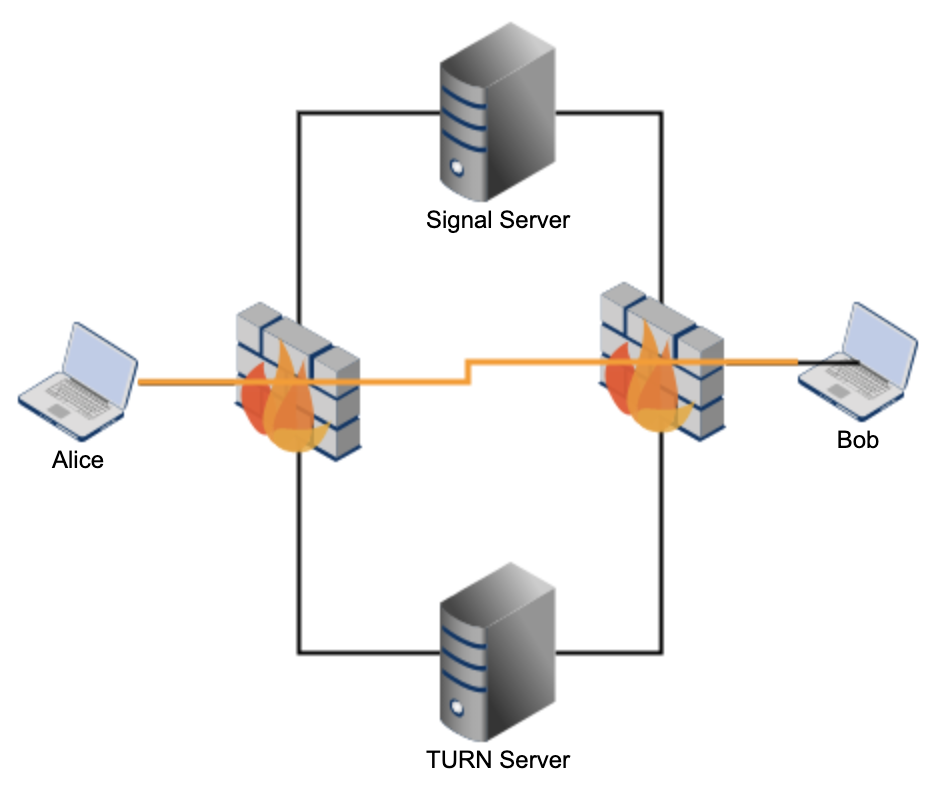
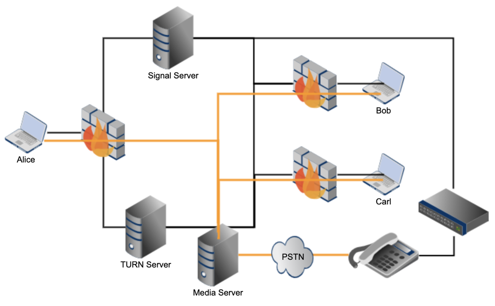

######################
WebRTC 应用实践要点
######################

.. contents::
    :local:

WebRTC 服务器
==========================================

WebRTC 的服务器大体分为信令服务器和媒体服务器

WebRTC 信令服务器是主要功能是为 WebRTC 通讯搭建一个了解彼此能力的通道, 交换信息, 同步改动.

而媒体服务器就是用来交换媒体，包括对媒体数据的加解密，编解码，带宽和速率控制等功能

不同的 `RTP Toplogies`_ 对服务器有不同的要求, WebRTC 或者说多媒体通信一般有如下的几种拓扑结构：

1. Point to Point 点对点
2. Point to Multipoint Using Multicast 单点到多点（使用多播）
3. Point to Multipoint Using the RFC 3550 Translator  单点到多点（使用RFC3550 的 Translator）
4. Point to Multipoint Using the RFC 3550 Mixer Model 单点到多点（使用RFC3550 的Mixer）
5. Point to Multipoint Using Video Switching MCUs 单点到多点（使用视频切换）
6. Point to Multipoint Using RTCP-Terminating MCU 单点到多点（使用RTCP 终结方式）
7. Non-Symmetric Mixer/Translators 非对称的 mixer/translator
8. Combining Topologies 混合拓扑

服务器的主要功能
=========================

P2P
-------------------------

如果是两个人之间的端到端 (P2P) 的通信, 信令服务器的功能很简单

1) 交换媒体通信和处理能力,主要是以 SDP 来描述
2) 交换连接地址, 比如 ICE Candidate

而由于是点对点的通信，媒体服务器也就不需要了。

SFU
----------------

如果是 SFU(Selective Forward Unit), 那么它的信令服务器除了上述的 SDP 媒体参数协商， ICE 连接地址交换，还有参加 RTP 会话的参加者信息的同步。

.. image:: ../_static/webrtc_sfu.webp

多个人之间的会议系统, 信令控制会麻烦很多,除了上述两个基本功能之外, 还要有

* 会议管理
* 成员管理
* 设备管理
* 会话管理
* 连接管理
* 媒体管理
* 管理会议中的实体

在 RFC4575 中有这样的定义

::

    conference-info
        |
        |-- conference-description
        |
        |-- host-info
        |
        |-- conference-state
        |
        |-- users
        |    |-- user
        |    |    |-- endpoint
        |    |    |    |-- media
        |    |    |    |-- media
        |    |    |    |-- call-info
        |    |    |
        |    |    |-- endpoint
        |    |         |-- media
        |    |-- user
        |         |-- endpoint
        |              |-- media
        |

        |-- sidebars-by-ref
        |    |-- entry
        |    |-- entry
        |
        |-- sidebars-by-val
            |-- entry
            |    |-- users
            |         |-- user
            |         |-- user
            |-- entry
                |-- users
                        |-- user
                        |-- user
                        |-- user

MCU
----------------

Multiple Control Unit 多点控制单元相比 SFU, 它有着对于媒体流的 Mix 和 translate 功能，可以很好地适配传统的通信设备，在实际应用中，一般我们会以 SFU 为主， MCU 为辅，共同形成一个服务器集群。

服务器中需要维护领域对象
============================

在 WebRTC 服务器上，我们一般会维护如下的领域对象

* Conference 
* Session 
* Participate 
* Device 
* Connection
* MediaSession
* MediaSessionDescription
* MediaStream
* MediaStreamTrack
* 等等

领域对象的具体内容从略，一般有如下的 Command 或 Event

应用层的事件大约可以分为 5 类

* Request: 包括 command
* Response
* Subscribe 
* Notify
* Message 就是一个消息，不要求响应, 例如 Presence 出席信息

具体的有

* Start 
* End
* Join 
* Leave 
* Offer
* Answer
* Mute
* Unmute
* Expel
* RaiseHand
* 等等

.. _RTP Toplogies: https://www.rfc-editor.org/rfc/rfc5117.html

WebRTC 的开源实现
=================================

.. list-table::
   :header-rows: 1
   :widths: 20 15 65

   * - 项目
     - 语言
     - 说明
   * - :doc:`janus`
     - C
     - 轻量级 WebRTC 网关，支持丰富的插件体系
   * - :doc:`pion`
     - Go
     - 纯 Go 实现，模块化设计，适合服务端开发
   * - :doc:`aiortc`
     - Python
     - 基于 asyncio 的纯 Python 实现，适合原型验证和 AI 集成
   * - :doc:`mediasoup`
     - C++/Node.js
     - 高性能 SFU，Node.js 控制层 + C++ 媒体层
   * - kurento
     - Java/C++
     - 媒体服务器，支持复杂的媒体处理 pipeline
   * - webrtc-rs
     - Rust
     - Pion 的 Rust 移植
   * - SIPSorcery
     - C#
     - .NET 生态的 WebRTC/SIP 库
   * - werift-webrtc
     - TypeScript
     - Node.js 上的 WebRTC 实现

Libraries
--------------------------------------------
* libwebrtc 
* libdatachannel

.. _webrtc-echoes: https://github.com/sipsorcery/webrtc-echoes