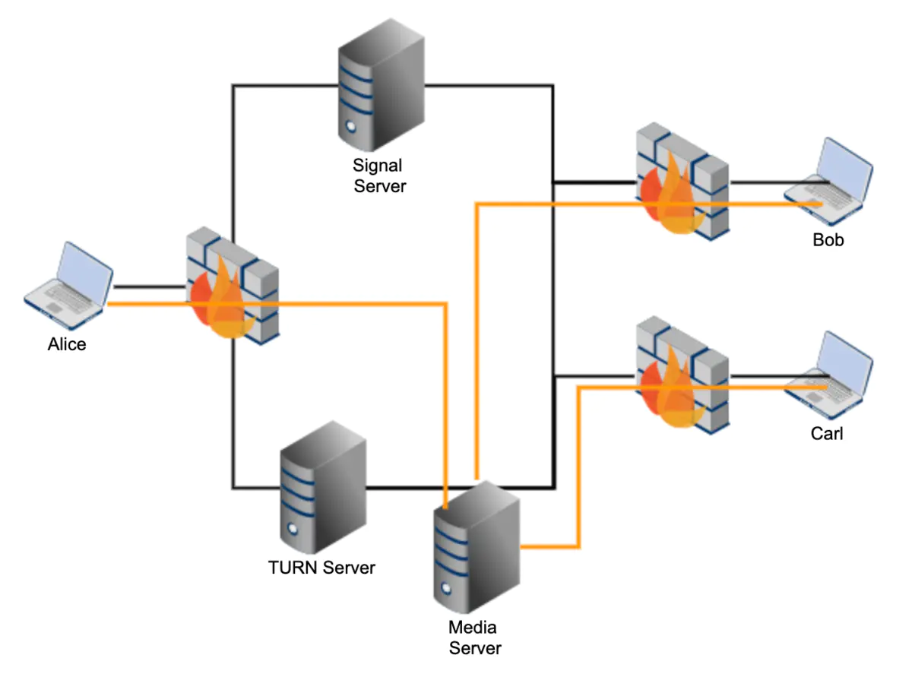

###################
SFU
###################

.. include:: ../links.ref
.. include:: ../tags.ref
.. include:: ../abbrs.ref

============ ==========================
**Abstract** SFU
**Authors**  Walter Fan
**Status**   v1.0
**Updated**  |date|
============ ==========================

.. contents:: Contents
   :local:

Overview
====================

选择性转发单元 SFU（Selective Forwarding Unit）在各个端点之间交换音频和视频流。 每个接收器方可以选择它所要接收的流和层（空间/时间上）。 与 MCU（多点控制单元）相比，这种设计可以带来更好的性能、更高的吞吐量和更少的延迟。 鉴于它不做转码或合成媒体，所以它具有高度可扩展性，并且需要的资源少得多。

由于各个端点分别获取其他端点的媒体，因此它们可以具有个性化的布局，并选择自己所要呈现的媒体流，以及决定如何显示它们。

SFU 可以看作一个多媒体流的路由器，实践中可以应用发布订阅模式（ publish/subscribe pattern）。发布者（Publisher）将媒体流发送到 SFU，SFU 根据订阅者（Subscriber）的需求，选择性地将媒体流转发给各个订阅者。

SFU 的核心优势在于：

* **低延迟**: 不需要解码和重新编码媒体流，转发延迟极低（通常 < 50ms）
* **低 CPU 消耗**: 不做转码操作，CPU 消耗远低于 MCU
* **高可扩展性**: 可以通过增加服务器节点来水平扩展
* **灵活性**: 每个订阅者可以独立选择接收的流和质量层级
* **端到端加密**: 由于不解码媒体，可以支持端到端加密（E2EE）

SFU vs MCU vs Mesh 对比
============================

在多方音视频通信中，有三种主要的架构模式：Mesh、MCU 和 SFU。它们各有优劣，适用于不同的场景。

.. list-table:: 架构对比
   :header-rows: 1
   :widths: 20 25 25 30

   * - 特性
     - Mesh（P2P 全连接）
     - MCU（多点控制单元）
     - SFU（选择性转发单元）
   * - 带宽（上行）
     - 高：每个参与者发送 N-1 份流
     - 低：每个参与者只发送 1 份流
     - 低：每个参与者只发送 1 份流
   * - 带宽（下行）
     - 高：接收 N-1 份流
     - 低：只接收 1 份合成流
     - 中：接收 N-1 份流（可通过 Simulcast 优化）
   * - 服务器 CPU
     - 无（无服务器）
     - 极高：需要解码、合成、重新编码
     - 低：仅做包转发
   * - 延迟
     - 最低：直接 P2P
     - 高：编解码引入延迟（100-500ms）
     - 低：仅转发延迟（< 50ms）
   * - 可扩展性
     - 差：参与者增加时客户端负载急剧增长
     - 中：受限于服务器编解码能力
     - 好：可水平扩展
   * - 视频质量
     - 原始质量
     - 可能降低：重新编码可能损失质量
     - 原始质量：不做转码
   * - 布局灵活性
     - 完全灵活：客户端自行决定
     - 受限：服务器决定合成布局
     - 完全灵活：客户端自行决定
   * - 端到端加密
     - 支持
     - 不支持：服务器需要解密
     - 支持（Insertable Streams）
   * - 适用人数
     - 2-4 人
     - 2-50 人
     - 2-1000+ 人
   * - 典型应用
     - 1 对 1 通话
     - 传统视频会议
     - 现代视频会议、直播

**选择建议**:

* **2 人通话**: 使用 Mesh（P2P），最简单且延迟最低
* **小型会议（3-6 人）**: SFU 是最佳选择，平衡了质量和资源消耗
* **大型会议（10+ 人）**: SFU + Simulcast + Last-N 策略
* **需要录制/合成**: MCU 或 SFU + 服务端录制
* **超大规模直播**: SFU 级联（Cascaded SFU）

SFU 架构
====================

一个典型的 SFU 服务器由以下几个核心模块组成：

Ingress（入口模块）
--------------------

Ingress 模块负责接收发布者（Publisher）的媒体流。其主要职责包括：

* **DTLS/SRTP 握手**: 与发布者建立安全的媒体传输通道
* **RTP 包接收**: 接收发布者发送的 RTP/RTCP 包
* **SSRC 管理**: 跟踪和管理发布者的 SSRC（Synchronization Source）
* **Jitter Buffer**: 可选的抖动缓冲，用于平滑接收到的媒体流
* **Simulcast 层识别**: 识别发布者发送的不同 Simulcast 层（通过 RID 或 SSRC 映射）
* **关键帧缓存**: 缓存最近的关键帧，以便新订阅者快速加入

.. code-block:: text

   Publisher A ──RTP/RTCP──> [DTLS/SRTP] ──> [Jitter Buffer] ──> [Ingress Router]
   Publisher B ──RTP/RTCP──> [DTLS/SRTP] ──> [Jitter Buffer] ──> [Ingress Router]

Routing（路由模块）
--------------------

Routing 模块是 SFU 的核心，负责决定将哪些媒体流转发给哪些订阅者。其决策依据包括：

* **订阅关系**: 订阅者订阅了哪些发布者的流
* **Simulcast 层选择**: 根据订阅者的带宽和显示需求选择合适的 Simulcast 层
* **SVC 层选择**: 选择合适的时间层（Temporal Layer）和空间层（Spatial Layer）
* **Last-N 策略**: 只转发最活跃的 N 个发言者的视频流
* **主讲人检测**: 检测当前的主讲人（Dominant Speaker），优先转发其视频
* **带宽分配**: 根据可用带宽在多个流之间分配比特率

.. code-block:: text

   [Ingress Router] ──> [Subscription Manager] ──> [Layer Selector] ──> [Bandwidth Allocator] ──> [Egress]

Egress（出口模块）
--------------------

Egress 模块负责将选定的媒体流发送给订阅者。其主要职责包括：

* **RTP 包转发**: 将选定的 RTP 包转发给订阅者
* **SSRC 重写**: 将发布者的 SSRC 重写为 SFU 分配的 SSRC
* **序列号重写**: 保持 RTP 序列号的连续性（因为 Simulcast 层切换时序列号会跳变）
* **时间戳调整**: 在层切换时调整 RTP 时间戳
* **拥塞控制**: 根据订阅者的网络状况调整发送速率
* **NACK 处理**: 响应订阅者的 NACK 请求，重传丢失的包
* **FEC 生成**: 可选地为订阅者生成前向纠错包

.. code-block:: text

   [Egress] ──> [SSRC Rewriter] ──> [Seq# Rewriter] ──> [Pacer] ──> [DTLS/SRTP] ──> Subscriber

Signaling（信令模块）
-----------------------

Signaling 模块负责房间和参与者的管理，通常通过 WebSocket 或 HTTP API 实现：

* **房间管理**: 创建、销毁、列出房间
* **参与者管理**: 加入、离开、踢出参与者
* **发布/订阅管理**: 管理发布者和订阅者的关系
* **SDP 协商**: 处理 Offer/Answer SDP 交换
* **ICE 候选交换**: 中转 ICE candidate
* **权限控制**: 控制谁可以发布、谁可以订阅
* **事件通知**: 通知参与者房间状态变化（新参与者加入、离开等）

.. code-block:: javascript

   // 典型的 SFU 信令消息示例
   // 加入房间
   { "type": "join", "roomId": "room-123", "displayName": "Alice" }

   // 发布媒体
   { "type": "publish", "sdp": "...", "simulcast": true }

   // 订阅媒体
   { "type": "subscribe", "publisherId": "user-456", "layers": { "spatial": 2, "temporal": 2 } }

   // 层切换请求
   { "type": "setPreferredLayers", "consumerId": "consumer-789", "spatial": 1, "temporal": 2 }

SFU 关键特性
====================

Simulcast 转发
--------------------

Simulcast（联播）是 SFU 中最重要的特性之一。发布者同时编码并发送多个不同分辨率/帧率的视频流（通常 3 层），SFU 根据每个订阅者的带宽和显示需求选择合适的层进行转发。

**Simulcast 层定义**:

.. list-table::
   :header-rows: 1
   :widths: 15 20 20 20 25

   * - 层级
     - 分辨率
     - 帧率
     - 比特率
     - 适用场景
   * - High (rid=f)
     - 1280x720
     - 30fps
     - 1500-2500 kbps
     - 大窗口/全屏显示
   * - Medium (rid=h)
     - 640x360
     - 15-30fps
     - 500-1000 kbps
     - 中等窗口显示
   * - Low (rid=q)
     - 320x180
     - 15fps
     - 100-300 kbps
     - 缩略图/画中画

**层选择策略**:

SFU 根据以下因素选择转发的 Simulcast 层：

1. **订阅者可用带宽**: 通过 REMB 或 Transport-CC 估算
2. **显示窗口大小**: 客户端上报当前显示窗口的尺寸
3. **网络拥塞状态**: 当网络拥塞时自动降级到低层
4. **优先级**: 主讲人的视频优先分配高层

.. code-block:: text

   Publisher ──[High 720p]──>
              ──[Med  360p]──> SFU ──[根据订阅者带宽选择层]──> Subscriber A (720p)
              ──[Low  180p]──>                                 Subscriber B (360p)
                                                               Subscriber C (180p)

SVC 转发
--------------------

SVC（Scalable Video Coding）是另一种可伸缩视频编码方式，与 Simulcast 不同，SVC 将所有层编码在同一个比特流中。SFU 可以通过丢弃高层的 NAL 单元来降低视频质量。

**SVC 层类型**:

* **Temporal Layer（时间层）**: 控制帧率。丢弃高时间层的帧可以降低帧率
* **Spatial Layer（空间层）**: 控制分辨率。丢弃高空间层可以降低分辨率
* **Quality Layer（质量层）**: 控制画质。丢弃高质量层可以降低画质

VP9 SVC 是 WebRTC 中最常用的 SVC 编码方式，支持灵活的时间层和空间层组合。

.. code-block:: text

   VP9 SVC 示例（2 空间层 x 3 时间层）:

   空间层 1 (720p): T0 ── T1 ── T2 ── T0 ── T1 ── T2
                      |         |         |         |
   空间层 0 (360p): T0 ── T1 ── T2 ── T0 ── T1 ── T2

   SFU 可以选择转发:
   - S1T2: 720p@30fps（完整质量）
   - S1T0: 720p@7.5fps（低帧率高分辨率）
   - S0T2: 360p@30fps（低分辨率高帧率）
   - S0T0: 360p@7.5fps（最低质量）

带宽估算
--------------------

SFU 需要为每个订阅者独立估算可用带宽，以便做出正确的层选择和转发决策。常用的带宽估算方法：

* **REMB（Receiver Estimated Maximum Bitrate）**: 订阅者通过 RTCP REMB 消息向 SFU 报告其估算的最大接收比特率。这是一种接收端驱动的带宽估算方法。

* **Transport-CC（Transport-wide Congestion Control）**: 订阅者通过 RTCP Transport-CC feedback 向 SFU 报告每个 RTP 包的接收时间，SFU 在发送端使用 GCC（Google Congestion Control）算法估算可用带宽。这是目前推荐的方法。

.. code-block:: text

   Transport-CC 工作流程:

   SFU ──[RTP + transport-cc ext]──> Subscriber
   SFU <──[RTCP Transport-CC FB]──── Subscriber
   SFU: 根据 feedback 计算 delay gradient → 估算带宽 → 调整发送速率

Last-N 策略
--------------------

在大型会议中（例如 20+ 参与者），将所有参与者的视频都转发给每个订阅者是不现实的。Last-N 策略只转发最近 N 个最活跃发言者的视频流。

**工作原理**:

1. SFU 持续监测所有参与者的音频能量级别（通过 ssrc-audio-level RTP 扩展）
2. 维护一个按活跃度排序的发言者列表
3. 只转发排名前 N 的发言者的视频流
4. 当发言者变化时，动态切换转发的视频流
5. 对于不在 Last-N 列表中的参与者，只转发音频流

.. code-block:: text

   20 个参与者, Last-N = 4:

   活跃发言者: [Alice, Bob, Charlie, David, ...]
   转发视频:    Alice(720p), Bob(360p), Charlie(360p), David(180p)
   其余 16 人:  只转发音频

主讲人检测（Dominant Speaker Detection）
------------------------------------------

主讲人检测算法用于确定当前正在发言的参与者。常用的算法基于音频能量级别的统计分析：

1. **短期能量**: 计算最近几百毫秒的音频能量平均值
2. **长期能量**: 计算最近几秒的音频能量平均值
3. **发言持续时间**: 考虑连续发言的时间长度
4. **切换阈值**: 设置切换阈值，避免频繁切换主讲人
5. **平滑处理**: 使用指数移动平均等方法平滑能量值

Opal 和 Opal 等开源项目中常用的主讲人检测算法参考了 Opal 的实现，通常使用以下参数：

* ``audio_active_packets``: 用于判断的音频包数量（默认 100，约 2 秒）
* ``audio_level_average``: 音频能量阈值（0=最大音量，127=静音，默认 25）

SFU 所需要的相关库
==========================

构建一个 SFU 服务器通常需要以下基础库：

网络 I/O 库
--------------------

* **libevent**: 高性能事件驱动网络库，支持 epoll/kqueue

  - example: https://github.com/eddieh/libevent-echo-server/blob/master/echo-server.c

* **libuv**: Node.js 底层使用的跨平台异步 I/O 库

  - example: https://github.com/eddieh/libuv-echo-server/blob/master/echo-server.c

* **Boost.Asio**: C++ 异步网络库

媒体处理库
--------------------

* **libsrtp**: SRTP 加密/解密库
* **OpenSSL / BoringSSL**: DTLS 握手和加密
* **libnice**: ICE 协议实现
* **usrsctp**: SCTP 协议实现（用于 DataChannel）
* **libwebrtc**: Google 的 WebRTC 原生库（包含完整的媒体栈）
* **libopus**: Opus 音频编解码器
* **libvpx**: VP8/VP9 视频编解码器

流行的 SFU 实现
====================

以下是目前最流行的开源 SFU 实现：

Janus Gateway（C 语言）
--------------------------

Janus 是一个通用的 WebRTC 服务器，采用插件架构，其中 VideoRoom 插件提供 SFU 功能。

* **语言**: C
* **协议**: WebRTC, SIP, RTSP
* **特点**: 插件架构、功能丰富、社区活跃
* **插件**: VideoRoom（SFU）、AudioBridge（MCU 混音）、Streaming、SIP Gateway 等
* **信令**: WebSocket, HTTP long-poll, RabbitMQ, MQTT, Nanomsg
* **GitHub**: https://github.com/meetecho/janus-gateway

mediasoup（C++/Node.js）
--------------------------

mediasoup 是一个高性能的 SFU 库，C++ 媒体 Worker 进程 + Node.js/Rust 控制层。

* **语言**: C++（媒体层）+ Node.js/Rust（控制层）
* **特点**: 极简 API、高性能、可嵌入
* **架构**: Worker → Router → Transport → Producer/Consumer
* **GitHub**: https://github.com/versatica/mediasoup

Pion（Go 语言）
--------------------

Pion 是一个纯 Go 语言实现的 WebRTC 库，可以用来构建 SFU。

* **语言**: Go
* **特点**: 纯 Go 实现、无 CGO 依赖、API 灵活
* **用途**: WebRTC 库（非开箱即用的 SFU，需要自行构建）
* **GitHub**: https://github.com/pion/webrtc

ion-sfu（Go 语言）
--------------------

ion-sfu 是基于 Pion 构建的开箱即用的 SFU 服务器。

* **语言**: Go
* **特点**: 基于 Pion、支持 Simulcast、支持 SVC
* **信令**: gRPC, JSON-RPC
* **GitHub**: https://github.com/pion/ion-sfu

LiveKit（Go 语言）
--------------------

LiveKit 是一个功能完善的开源 WebRTC 基础设施平台，基于 Pion 构建。

* **语言**: Go（服务端）+ 多语言 SDK
* **特点**: 生产级、支持 Simulcast/SVC、内置录制、Egress/Ingress
* **信令**: WebSocket + Protocol Buffers
* **扩展**: 内置集群支持（基于 Redis）
* **SDK**: JavaScript, React, Swift, Kotlin, Flutter, Unity, Rust, Python, Go
* **GitHub**: https://github.com/livekit/livekit

.. list-table:: SFU 实现对比
   :header-rows: 1
   :widths: 15 12 12 15 15 15 16

   * - 项目
     - 语言
     - Simulcast
     - SVC
     - DataChannel
     - 集群支持
     - 适用场景
   * - Janus
     - C
     - ✓
     - ✓ (VP9)
     - ✓
     - 需自行实现
     - 通用 WebRTC 服务器
   * - mediasoup
     - C++/Node.js
     - ✓
     - ✓ (VP9)
     - ✓
     - PipeTransport
     - 高性能嵌入式 SFU
   * - Pion
     - Go
     - ✓
     - ✓
     - ✓
     - 需自行实现
     - 自定义 WebRTC 应用
   * - ion-sfu
     - Go
     - ✓
     - ✓
     - ✓
     - 部分支持
     - 轻量级 SFU
   * - LiveKit
     - Go
     - ✓
     - ✓
     - ✓
     - ✓ (Redis)
     - 生产级平台

SFU 可扩展性
====================

级联 SFU（Cascaded SFU）
--------------------------

当单个 SFU 节点无法承载所有参与者时，可以使用级联 SFU 架构。多个 SFU 节点通过内部连接（PipeTransport 或专用协议）互相转发媒体流。

.. code-block:: text

   Region A                    Region B
   ┌──────────────┐            ┌──────────────┐
   │   SFU Node 1 │◄──Pipe──►│   SFU Node 2 │
   │              │            │              │
   │ User A ──►   │            │   ──► User C │
   │ User B ──►   │            │   ──► User D │
   └──────────────┘            └──────────────┘

**级联策略**:

* **Full Mesh Cascade**: 每个 SFU 节点与所有其他节点建立连接。简单但不适合大规模部署。
* **Tree Cascade**: 使用树形拓扑，减少节点间连接数。适合地理分布式部署。
* **Star Cascade**: 使用中心节点作为媒体中转。简化管理但中心节点可能成为瓶颈。

地理分布
--------------------

为了降低延迟，SFU 节点应部署在靠近用户的地理位置。典型的部署策略：

1. **多区域部署**: 在全球多个数据中心部署 SFU 节点
2. **就近接入**: 用户连接到最近的 SFU 节点（通过 DNS 地理解析或 Anycast）
3. **跨区域级联**: 不同区域的 SFU 节点通过高速骨干网互联
4. **智能路由**: 根据网络质量动态选择最优路径

负载均衡策略
--------------------

SFU 的负载均衡需要考虑以下因素：

* **CPU 使用率**: 包转发和加密操作消耗 CPU
* **带宽使用率**: 入站和出站带宽
* **连接数**: 当前活跃的 PeerConnection 数量
* **房间亲和性**: 同一房间的参与者尽量分配到同一节点，减少跨节点转发
* **地理亲和性**: 将用户分配到地理位置最近的节点

.. code-block:: text

   Load Balancer 决策流程:

   新用户请求 → 检查房间所在节点 → 节点负载是否可接受?
                                      ├── 是 → 分配到该节点
                                      └── 否 → 选择同区域负载最低的节点
                                                → 建立级联连接

SFU 优化
====================

带宽分配算法
--------------------

当订阅者的可用带宽不足以接收所有订阅流的最高质量时，SFU 需要在多个流之间分配带宽。常用的分配策略：

1. **均等分配**: 将可用带宽均等分配给所有订阅的流
2. **优先级分配**: 根据流的优先级（如主讲人优先）分配带宽
3. **MaxMin 公平分配**: 保证每个流至少获得最低质量的带宽，剩余带宽按优先级分配
4. **自适应分配**: 根据显示窗口大小和内容类型动态调整

.. code-block:: text

   示例: 可用带宽 2000 kbps, 订阅 4 个流

   优先级分配:
   - 主讲人 (高优先级): 720p @ 1200 kbps
   - 参与者 B (中优先级): 360p @ 400 kbps
   - 参与者 C (中优先级): 360p @ 300 kbps
   - 参与者 D (低优先级): 180p @ 100 kbps

包路由优化
--------------------

SFU 的核心操作是包转发，优化包路由可以显著提升性能：

* **零拷贝转发**: 避免不必要的内存拷贝，直接将接收缓冲区的数据转发到发送缓冲区
* **批量发送**: 使用 ``sendmmsg()`` 系统调用批量发送多个 UDP 包
* **批量接收**: 使用 ``recvmmsg()`` 系统调用批量接收多个 UDP 包
* **内核旁路**: 使用 DPDK 或 XDP 绕过内核网络栈，直接在用户空间处理网络包
* **NUMA 感知**: 在多 CPU 服务器上，确保网络 I/O 和包处理在同一 NUMA 节点上

NACK/FEC 处理
--------------------

SFU 在处理丢包恢复时有特殊的考虑：

**NACK 处理**:

* SFU 维护一个发送历史缓冲区（通常缓存最近 1-2 秒的 RTP 包）
* 当收到订阅者的 NACK 请求时，从缓冲区中查找并重传丢失的包
* SFU 也可以向发布者发送 NACK，请求重传 SFU 自身丢失的包

**FEC 处理**:

* SFU 可以透传发布者生成的 FEC 包
* SFU 也可以为每个订阅者独立生成 FEC 包（根据订阅者的丢包率调整 FEC 冗余度）
* FlexFEC 和 UlpFEC 是 WebRTC 中常用的 FEC 方案

**PLI/FIR 处理**:

* 当订阅者请求关键帧（PLI/FIR）时，SFU 可以：
  1. 从关键帧缓存中直接响应
  2. 将请求转发给发布者
  3. 合并多个订阅者的关键帧请求，避免频繁请求

WebRTC 客户端 SFU 集成
============================

多 PeerConnection vs Unified Plan
--------------------------------------

与 SFU 交互时，客户端有两种主要的 PeerConnection 管理方式：

**Plan B（已废弃）/ 多 PeerConnection**:

* 每个发布/订阅使用独立的 PeerConnection
* 优点：隔离性好，单个连接失败不影响其他连接
* 缺点：ICE 连接数多，资源消耗大

**Unified Plan（推荐）**:

* 使用单个 PeerConnection，通过多个 Transceiver 管理多个流
* 优点：资源消耗少，ICE 连接复用
* 缺点：SDP 管理复杂

.. code-block:: javascript

   // Unified Plan: 使用单个 PeerConnection
   const pc = new RTCPeerConnection(config);

   // 发布本地媒体
   const stream = await navigator.mediaDevices.getUserMedia({ video: true, audio: true });
   stream.getTracks().forEach(track => {
     const transceiver = pc.addTransceiver(track, {
       direction: 'sendonly',
       sendEncodings: [
         { rid: 'q', maxBitrate: 150000, scaleResolutionDownBy: 4 },
         { rid: 'h', maxBitrate: 500000, scaleResolutionDownBy: 2 },
         { rid: 'f', maxBitrate: 1500000 }
       ]
     });
   });

   // 订阅远端媒体
   pc.ontrack = (event) => {
     const remoteStream = event.streams[0];
     document.getElementById('remoteVideo').srcObject = remoteStream;
   };

Transceiver 管理
--------------------

在 Unified Plan 模式下，Transceiver 的管理至关重要：

.. code-block:: javascript

   // 添加接收 Transceiver（用于订阅远端流）
   pc.addTransceiver('video', { direction: 'recvonly' });
   pc.addTransceiver('audio', { direction: 'recvonly' });

   // 动态调整 Transceiver 方向
   const transceivers = pc.getTransceivers();
   transceivers[0].direction = 'sendrecv'; // 改为双向

   // 停止 Transceiver
   transceivers[0].stop();

Stats 监控
--------------------

客户端应持续监控 WebRTC 统计信息，以便诊断问题和优化体验：

.. code-block:: javascript

   // 定期获取统计信息
   setInterval(async () => {
     const stats = await pc.getStats();
     stats.forEach(report => {
       if (report.type === 'inbound-rtp' && report.kind === 'video') {
         console.log(`Video inbound: ${report.bytesReceived} bytes, ` +
                      `${report.framesDecoded} frames, ` +
                      `${report.packetsLost} lost, ` +
                      `jitter: ${report.jitter}`);
       }
       if (report.type === 'outbound-rtp' && report.kind === 'video') {
         console.log(`Video outbound: ${report.bytesSent} bytes, ` +
                      `qualityLimitationReason: ${report.qualityLimitationReason}`);
       }
     });
   }, 2000);

Features
====================

典型的 SFU 服务器提供以下 API 操作：

- ``create``, ``destroy``, ``edit``, ``exists``, ``list``, ``allowed``, ``kick`` 和 ``listparticipants`` 是同步请求

- ``join``, ``joinandconfigure``, ``configure``, ``publish``, ``unpublish``, ``start``, ``pause``, ``switch`` 和 ``leave`` 请求则是异步的

Example
====================

Janus
--------------------

refer to https://janus.conf.meetecho.com/docs/videoroom.html

.. code-block::

    room-<unique room ID>: {
            description = This is my awesome room
            is_private = true|false (private rooms don't appear when you do a 'list' request, default=false)
            secret = <optional password needed for manipulating (e.g. destroying) the room>
            pin = <optional password needed for joining the room>
            require_pvtid = true|false (whether subscriptions are required to provide a valid private_id
                                    to associate with a publisher, default=false)
            publishers = <max number of concurrent senders> (e.g., 6 for a video
                                    conference or 1 for a webinar, default=3)
            bitrate = <max video bitrate for senders> (e.g., 128000)
            bitrate_cap = <true|false, whether the above cap should act as a limit to dynamic bitrate changes by publishers, default=false>,
            fir_freq = <send a FIR to publishers every fir_freq seconds> (0=disable)
            audiocodec = opus|g722|pcmu|pcma|isac32|isac16 (audio codec to force on publishers, default=opus
                                    can be a comma separated list in order of preference, e.g., opus,pcmu)
            videocodec = vp8|vp9|h264|av1|h265 (video codec to force on publishers, default=vp8
                                    can be a comma separated list in order of preference, e.g., vp9,vp8,h264)
            vp9_profile = VP9-specific profile to prefer (e.g., "2" for "profile-id=2")
            h264_profile = H.264-specific profile to prefer (e.g., "42e01f" for "profile-level-id=42e01f")
            opus_fec = true|false (whether inband FEC must be negotiated; only works for Opus, default=false)
            video_svc = true|false (whether SVC support must be enabled; only works for VP9, default=false)
            audiolevel_ext = true|false (whether the ssrc-audio-level RTP extension must be
                    negotiated/used or not for new publishers, default=true)
            audiolevel_event = true|false (whether to emit event to other users or not, default=false)
            audio_active_packets = 100 (number of packets with audio level, default=100, 2 seconds)
            audio_level_average = 25 (average value of audio level, 127=muted, 0='too loud', default=25)
            videoorient_ext = true|false (whether the video-orientation RTP extension must be
                    negotiated/used or not for new publishers, default=true)
            playoutdelay_ext = true|false (whether the playout-delay RTP extension must be
                    negotiated/used or not for new publishers, default=true)
            transport_wide_cc_ext = true|false (whether the transport wide CC RTP extension must be
                    negotiated/used or not for new publishers, default=true)
            record = true|false (whether this room should be recorded, default=false)
            rec_dir = <folder where recordings should be stored, when enabled>
            lock_record = true|false (whether recording can only be started/stopped if the secret
                                    is provided, or using the global enable_recording request, default=false)
            notify_joining = true|false (optional, whether to notify all participants when a new
                                    participant joins the room. The Videoroom plugin by design only notifies
                                    new feeds (publishers), and enabling this may result extra notification
                                    traffic. This flag is particularly useful when enabled with require_pvtid
                                    for admin to manage listening only participants. default=false)
            require_e2ee = true|false (whether all participants are required to publish and subscribe
                                    using end-to-end media encryption, e.g., via Insertable Streams; default=false)
    }

Reference
=======================
* MediaSoup rtp-parameters-and-capabilities

  - https://mediasoup.org/documentation/v3/mediasoup/rtp-parameters-and-capabilities

* RFC 7667 - RTP Topologies

  - https://tools.ietf.org/html/rfc7667

* WebRTC SFU 架构设计

  - https://webrtcforthecurious.com/

* Janus Gateway 文档

  - https://janus.conf.meetecho.com/docs/

* mediasoup 文档

  - https://mediasoup.org/documentation/v3/

* LiveKit 文档

  - https://docs.livekit.io/

* Pion WebRTC

  - https://github.com/pion/webrtc

* Opal (WebRTC C++ SFU)

  - https://opalvoip.org/

* Scalable Video Coding (SVC) in WebRTC

  - https://www.w3.org/TR/webrtc-svc/

* Google Congestion Control (GCC)

  - https://datatracker.ietf.org/doc/html/draft-ietf-rmcat-gcc-02
